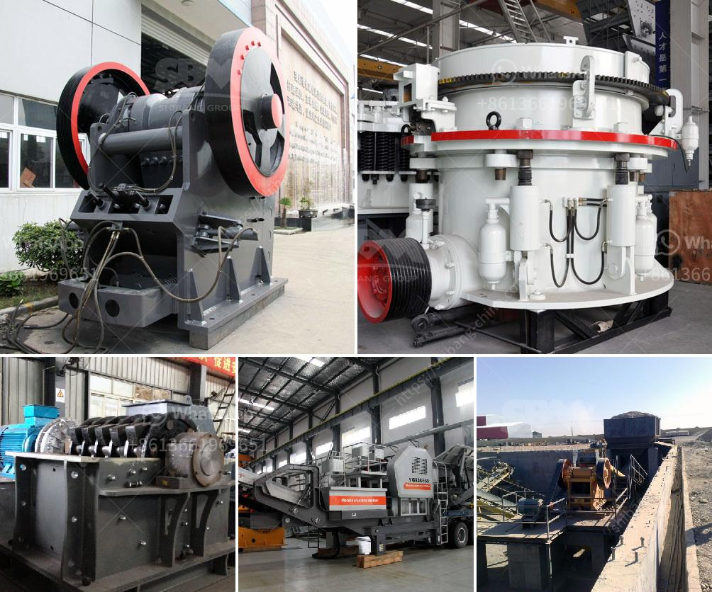

<h3>used quarry machine germany</h3>
Quarrying operations require heavy machinery to extract, transport, and process limestone, granite, and other aggregates. For cost-conscious quarry operators or those seeking to expand their facilities, acquiring used quarry machines from Germany offers an attractive alternative. Germany, known for its engineering prowess and high-quality manufacturing, has a thriving used machinery industry that provides fully functional and reliable quarry equipment. In this article, we will explore the benefits and considerations of purchasing used quarry machines in Germany.

One of the primary reasons quarry operators prefer used machinery from Germany is the significant cost savings compared to buying new equipment. The used machinery market in Germany offers competitive pricing for a wide variety of quarry machines, including excavators, wheel loaders, crushers, and screening plants. The cost savings can be substantial, enabling operators to allocate resources more efficiently and potentially invest in other areas, such as technology upgrades or personnel training.

German machinery is renowned worldwide for its durability, precision engineering, and longevity. Used quarry machines from Germany are typically well-maintained and have undergone stringent maintenance checks or refurbishment before being made available in the market. These refurbished machines are often still in excellent condition, offering high operational efficiency and reliability. Superior German engineering ensures that used quarry machines provide long service lives, even when subjected to the demanding conditions of quarry operations.

Germany's used machinery market offers an extensive range of quarry equipment, making it easier for operators to find machines that precisely match their operational requirements. From specialized excavators designed for heavy-duty digging to crushers tailored for specific aggregate sizes, the options are diverse and cater to various quarrying needs. This variety empowers operators to select the most suitable machines that align with their specific production targets and operational demands.

Purchasing used quarry machines from Germany provides access to a wealth of expertise and information supporting the equipment. Reputable machinery dealers often offer comprehensive documentation, including service records, maintenance histories, and operating manuals. This documentation can assist operators in understanding the equipment's maintenance requirements, troubleshooting, and maximizing its usage potential. Additionally, machinery dealers often have experienced technicians and engineers who can provide expert advice or support should any issues arise during operation.

Opting for used quarry machines promotes sustainability by reducing the demand for new machinery production. By repurposing machinery and extending its lifespan, operators contribute to the conservation of natural resources and the reduction of carbon footprints. Germany's commitment to environmental stewardship translates even to the used machinery market, with dealers ensuring machinery compliance with emission standards and providing eco-friendly options.

Used quarry machines from Germany offer an attractive proposition for quarry operators. Cost savings, durability, high-quality engineering, extensive options, expert support, and the promotion of sustainability all make acquiring used quarry machines a worthwhile investment. With Germany's well-established used machinery market, quarry operators can take advantage of reliable equipment to enhance productivity and profitability while operating in a more environmentally conscious manner.
<h3>Contact us</h3><ul><li><strong>Whatsapp:&nbsp;<a href="https://wa.me/8613661969651">+8613661969651</a></strong></li><li><a href="https://swt.shibang-china.com/?git&amp;zhl&amp;used quarry machine germany"><strong>Online Service(chat now)</strong></a></li></ul><h3>Related</h3><ul><li><a href='stone crushing process costs.md'>stone crushing process costs</a></li><li><a href='hammer crusher in japan.md'>hammer crusher in japan</a></li><li><a href='hammer mill capacity 80 ton per hour.md'>hammer mill capacity 80 ton per hour</a></li><li><a href='construction  demolition recycling.md'>construction & demolition recycling</a></li><li><a href='stone crusher plant 100tph layout.md'>stone crusher plant 100tph layout</a></li></ul>