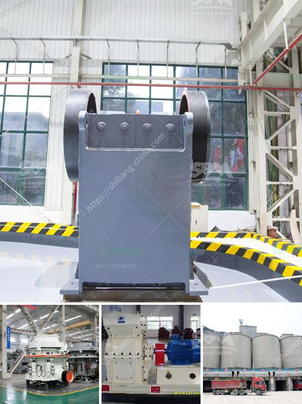

<h3>used raymond grinding mill sale in pakistan</h3>
Raymond grinding mill is widely used in the grinding process metallurgy, building materials, chemicals, mining and minerals. It is suitable for processing non-flammable and non-explosive materials such as barite, calcite, potassium feldspar, talc, marble, limestone, gypsum, quartz, activated clay, activated carbon, bentonite, kaolin, cement, phosphate rock, gypsum, glass and insulation materials with less than 9.3 Mohs hardness and humidity below 6%. The particle size of the finished product can be adjusted in the range of 80-325 mesh.

Pakistan has rich mineral resources and Raymond grinding mill is widely used in various ore materials. The equipment enjoys a good reputation among customers. It is recognized by the market, and has become a typical representative of the milling industry in Pakistan.

With the development of the economy, Pakistan's infrastructure construction is in full swing. The demand for grinding equipment is increasing, and Raymond grinding mills are being more and more widely used. The sale of used Raymond grinding mills in Pakistan is very popular, and the market response is good.

In recent years, the market demand has shifted from traditional Raymond grinding mills to ultra-fine grinding mills. The ultra-fine grinding mill has a wide range of applications and can process various non-metallic ores. For different fineness requirements, it can adjust the number of grinding rolls, the number of grinding rings, and the speed of the classifier. It has various configurations to meet different needs.

However, the traditional Raymond grinding mill still has a broad market due to its advantages such as stable performance, simple operation, low maintenance cost, and high efficiency. This is especially true for customers with a limited budget. The used Raymond grinding mill is the most economical and practical choice for them.

When purchasing a used Raymond grinding mill, customers should pay attention to the following points:

First, check the overall condition of the equipment, including the wear of the grinding ring and roller. If the wear is serious, it will affect the production efficiency of the mill.

Second, check the engine oil and lubrication system to ensure that the equipment runs smoothly. If the lubricating oil is insufficient or deteriorated, it may cause damage to the transmission parts.

Third, check the electrical control system and control whether it is working properly. Test the operation of the motor, reducer, and fan to see if there are any abnormal noises.

Finally, verify the after-sales service. Make sure that there is a warranty period for the used grinding mill, and that regular maintenance and repair services can be provided.

In conclusion, the sale of used Raymond grinding mills in Pakistan is a reliable and economical choice. Customers can consider purchasing the equipment according to their actual production needs and budget. Whether it is a traditional Raymond grinding mill or an ultra-fine grinding mill, both have their own advantages. It is recommended to choose the most suitable equipment for your specific needs.
<h3>Contact us</h3><ul><li><strong>Whatsapp:&nbsp;<a href="https://wa.me/8613661969651">+8613661969651</a></strong></li><li><a href="https://swt.shibang-china.com/?git&amp;zhl&amp;used raymond grinding mill sale in pakistan"><strong>Online Service(chat now)</strong></a></li></ul><h3>Related</h3><ul><li><a href='chrome ore crushers and screeners for hire in south africa.md'>chrome ore crushers and screeners for hire in south africa</a></li><li><a href='mobile crushing and screening.md'>mobile crushing and screening</a></li><li><a href='approach to the problem of a mineral crusher.md'>approach to the problem of a mineral crusher</a></li><li><a href='grinding mill for bentonite.md'>grinding mill for bentonite</a></li><li><a href='used korean made stone crusher.md'>used korean made stone crusher</a></li></ul>