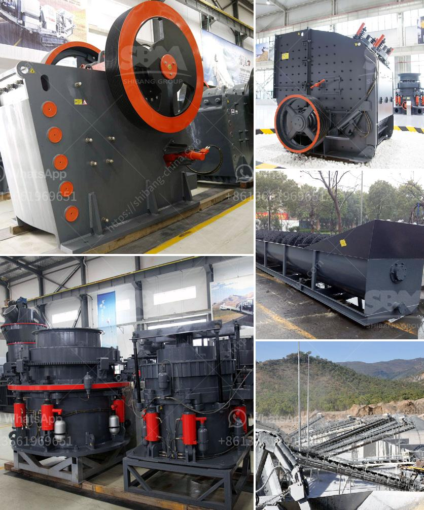

<h3>used roller mill in kenya</h3>
Roller milling is an effective and efficient way to grind different grains and cereals, such as wheat, maize, and millet, into powdered form. In Kenya, this milling process is widely used in both large-scale factories and small-scale household operations. Used roller mills in Kenya are readily available, making it a cost-effective solution for farmers and entrepreneurs.

One of the biggest advantages of using a roller mill is its ability to produce uniform and consistent particles. The grains are fed into the mill, where they are crushed by a series of rotating rollers. These rollers can be adjusted to different settings, allowing the operator to determine the fineness of the final product. This uniformity in particle size is important for various applications, such as animal feed, flour production, and brewing.

Another benefit of using a used roller mill in Kenya is its durability. Many roller mills are built to last, with sturdy construction and high-quality materials. When properly maintained, a used roller mill can serve for many years, providing reliable and consistent results. This is particularly important for small-scale farmers and entrepreneurs who may not have the financial means to invest in brand new equipment.

Furthermore, investing in a used roller mill can significantly reduce costs. New roller mills can be quite expensive, especially for small businesses. By purchasing a used mill, farmers and entrepreneurs can save a considerable amount of money while still achieving the desired grinding outcome. This cost-saving factor makes used roller mills a popular choice for many individuals in Kenya's agricultural sector.

In conclusion, the use of used roller mills in Kenya offers several advantages. From consistent and uniform grinding to durability and cost-effectiveness, roller milling has proven to be a valuable process for farmers and entrepreneurs in the country. Therefore, it is worth considering this option for those looking to improve their grain processing capabilities.
<h3>Contact us</h3><ul><li><strong>Whatsapp:&nbsp;<a href="https://wa.me/8613661969651">+8613661969651</a></strong></li><li><a href="https://swt.shibang-china.com/?git&amp;zhl&amp;used roller mill in kenya"><strong>Online Service(chat now)</strong></a></li></ul><h3>Related</h3><ul><li><a href='used industrial dryer for sale in india.md'>used industrial dryer for sale in india</a></li><li><a href='marble grinder mill machine.md'>marble grinder mill machine</a></li><li><a href='mobile coal crusher for sale in south africa.md'>mobile coal crusher for sale in south africa</a></li><li><a href='calcium carbonate plant in bulacan.md'>calcium carbonate plant in bulacan</a></li><li><a href='marble powder mill machinery.md'>marble powder mill machinery</a></li></ul>