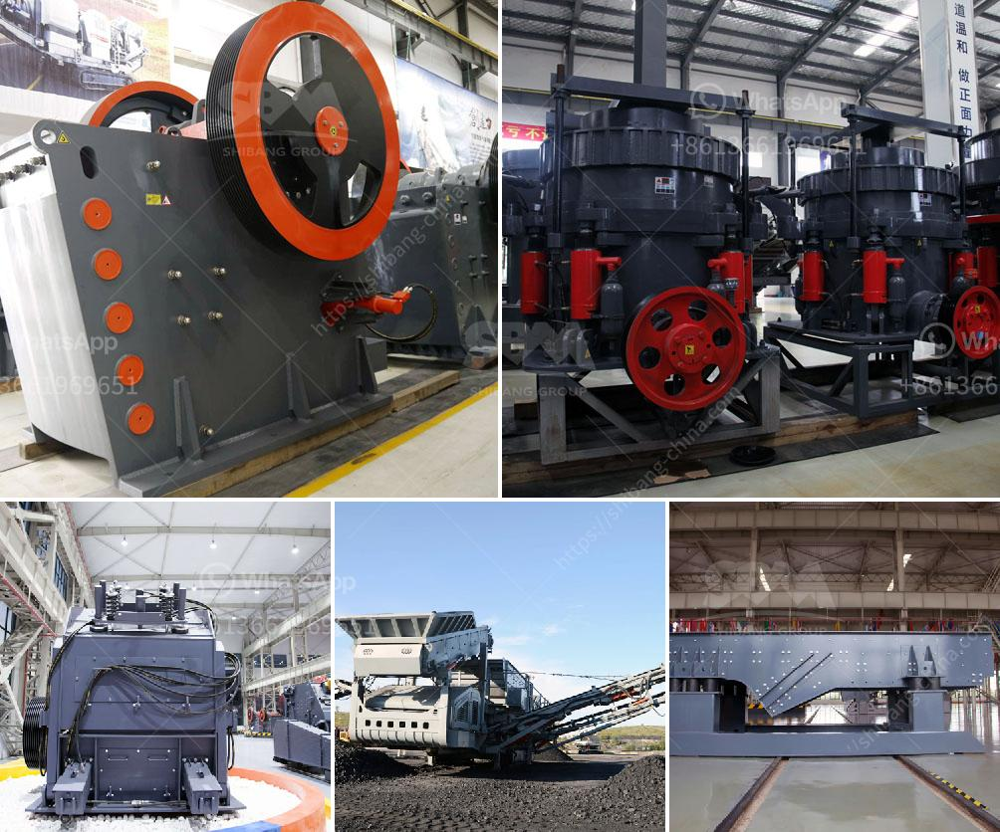

<h3>used roller mills for sale</h3>
Roller mills have been a staple in the industrial processing industry for well over a century. These high-performance machines are used to grind various materials into fine particles, ensuring the uniformity and consistency of the end product. If you are in the market for a roller mill, buying a used one can be a cost-effective solution to meet your industrial needs without breaking the bank.

When it comes to industrial processing, efficiency and reliability are paramount. Roller mills are renowned for their ability to process a wide range of materials, from grains and minerals to chemicals and even plastics. These machines work by grinding the material between two cylindrical rollers, creating a controlled and precise particle size distribution. This not only ensures consistent product quality but also maximizes the yield and minimizes waste.

Investing in a roller mill can be a significant financial decision for any business. However, buying a used roller mill can provide substantial cost savings while still meeting your production requirements. Used roller mills are readily available on the market, either through online auctions, second-hand equipment dealers, or directly from manufacturers who offer reconditioned models. These machines are often well-maintained and undergo rigorous inspections, ensuring their quality and functionality.

One of the main advantages of buying used roller mills is the considerable cost savings. A new roller mill can cost thousands or even tens of thousands of dollars depending on the size and specifications. On the other hand, used roller mills are typically sold at a fraction of the price, making them an attractive option for businesses seeking to optimize their budget. These cost savings can be redirected to other areas of your operations, such as upgrading or expanding your production line.

Another benefit of purchasing a used roller mill is the quick availability. Unlike ordering a new machine, which often involves longer lead times and waiting for production and shipping, used roller mills are typically ready to be installed and put into operation. This is particularly advantageous for businesses that require immediate replacement or have time-sensitive projects. By purchasing a used roller mill, you can minimize production downtime and maintain continuous operations.

Furthermore, opting for a used roller mill allows you to assess its performance and suitability for your specific needs. By reviewing the machine's history, maintenance records, and any available test runs, you can gain valuable insights into its capabilities. This knowledge enables you to choose a roller mill that can effectively process your desired materials while meeting your desired particle size requirements. Additionally, you can leverage the experience and knowledge of the machine's previous owner or dealer for guidance on its operational and maintenance best practices.

In conclusion, used roller mills for sale offer a cost-effective and efficient solution for businesses looking to optimize their industrial processes. With their ability to grind various materials to a controlled and desired particle size distribution, roller mills play a critical role in industries ranging from food processing to pharmaceuticals. By purchasing a used roller mill, you can enjoy significant cost savings, quick availability, and the opportunity to evaluate its performance for your specific needs. So, if you are in need of a roller mill, consider exploring the used equipment market to find the best value for your investment.
<h3>Contact us</h3><ul><li><strong>Whatsapp:&nbsp;<a href="https://wa.me/8613661969651">+8613661969651</a></strong></li><li><a href="https://swt.shibang-china.com/?git&amp;zhl&amp;used roller mills for sale"><strong>Online Service(chat now)</strong></a></li></ul><h3>Related</h3><ul><li><a href='quarry equipment in kenya.md'>quarry equipment in kenya</a></li><li><a href='manganese ore sintering process.md'>manganese ore sintering process</a></li><li><a href='screening machine for phosphate mineral processing zmy.md'>screening machine for phosphate mineral processing zmy</a></li><li><a href='stone crusher price of 30 tons per hour.md'>stone crusher price of 30 tons per hour</a></li><li><a href='micronized quartz crusher plant.md'>micronized quartz crusher plant</a></li></ul>