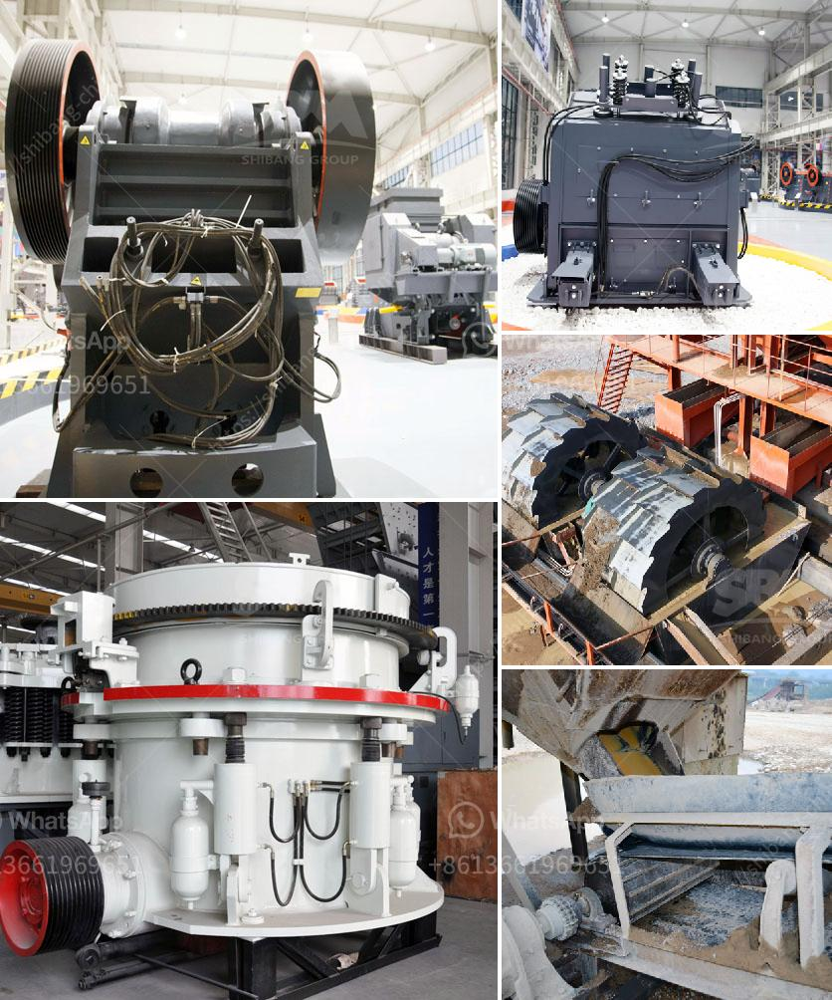

<h3>used sand wash equipment</h3>
In the construction and mining industries, the demand for clean and high-quality sand is ever-growing. Whether it is for building roads and bridges or manufacturing concrete, sand plays a vital role in various applications. However, natural sand is often mixed with impurities, debris, and clays that hinder its usability. This is where sand wash equipment comes into play.

Sand wash equipment is specifically designed to clean and wash sand by separating and removing the unwanted impurities. Used sand wash equipment is an excellent option for businesses looking for cost-effective solutions to their sand washing needs. In this article, we will explore the benefits and advantages of using used sand wash equipment.

Cost Savings: One of the primary advantages of purchasing used sand wash equipment is the substantial cost savings. Buying second-hand equipment can save businesses a significant amount of money compared to investing in brand-new machines. Used sand wash equipment is often available at a fraction of the original price, allowing companies to access the same level of functionality and efficiency at a reduced cost.

Reliability: Although it may be tempting to always opt for brand-new equipment, used sand wash equipment can be just as reliable. When purchased from reputable sellers, used machines are thoroughly inspected and refurbished to meet industry standards. This ensures that the equipment is in good working condition and can deliver the desired results. In fact, many used sand wash equipment have been well-maintained by their previous owners, making them a reliable choice for businesses.

Immediate Availability: Another advantage of used sand wash equipment is immediate availability. Unlike when purchasing new equipment, which may involve long waiting times for production and delivery, used machines are already on hand and ready for use. This means businesses can start using the equipment right away, saving valuable time and allowing for immediate operational advantages.

Environmental Responsibility: By opting for used sand wash equipment, businesses can demonstrate their commitment to environmental responsibility. Instead of contributing to the demand for new manufacturing processes, purchasing used equipment helps reduce energy consumption, carbon emissions, and waste. Choosing used equipment also extends its lifespan, reducing the overall environmental impact associated with machinery production and disposal.

Flexible Options: Used sand wash equipment offers businesses a wide range of options to choose from. Whether it's a spiral sand washer, bucket wheel, or sand screw, there are various types and models that can cater to specific needs and requirements. The availability of different options allows businesses to find the perfect machinery that suits their specific sand washing needs without having to compromise on quality or functionality.

In conclusion, used sand wash equipment can be an excellent choice for businesses in need of cost-effective, reliable, and efficient sand washing solutions. With substantial cost savings, immediate availability, and a wide range of options to choose from, businesses can meet their sand washing requirements without breaking the bank. Furthermore, investing in used equipment demonstrates environmental responsibility, contributing to sustainability efforts. Therefore, businesses should consider exploring the market for used sand wash equipment to achieve their desired level of cleanliness and efficiency.
<h3>Contact us</h3><ul><li><strong>Whatsapp:&nbsp;<a href="https://wa.me/8613661969651">+8613661969651</a></strong></li><li><a href="https://swt.shibang-china.com/?git&amp;zhl&amp;used sand wash equipment"><strong>Online Service(chat now)</strong></a></li></ul><h3>Related</h3><ul><li><a href='stone crusher machine spintex accra.md'>stone crusher machine spintex accra</a></li><li><a href='aggregate crusher plant.md'>aggregate crusher plant</a></li><li><a href='dolomite powder grinding mill in india.md'>dolomite powder grinding mill in india</a></li><li><a href='price of marble grinder mill.md'>price of marble grinder mill</a></li><li><a href='cost to open a mini cement plant.md'>cost to open a mini cement plant</a></li></ul>