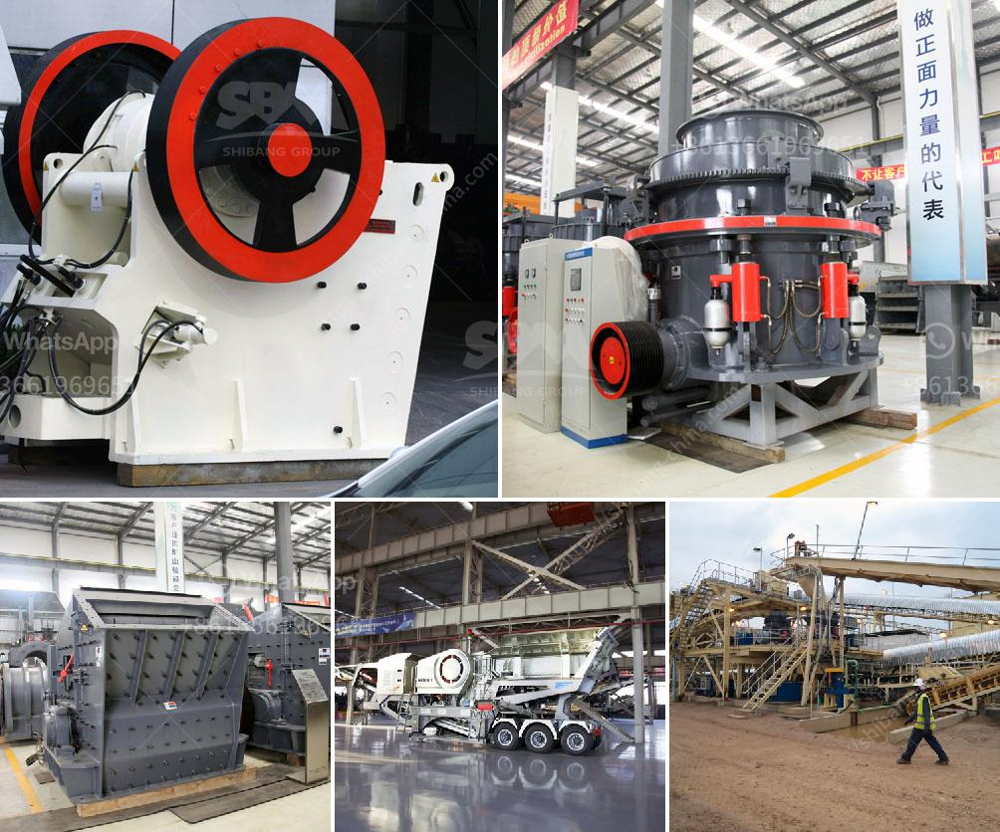

<h3>used small gold processing plant from dubai</h3>
Dubai is well-known for its luxurious lifestyle and extravagant shopping experiences. However, the city also has a thriving industrial sector, with a particular focus on gold processing. With its strategic geographical location and advanced infrastructure, Dubai has become a hub for buying and selling gold.

In recent years, there has been a significant demand for used small gold processing plants in Dubai. These plants are designed to extract gold from the ore efficiently and effectively. Whether from mining operations or recycled gold materials, these processing plants play a crucial role in the gold industry.

The advantage of purchasing a used small gold processing plant is that it offers cost-effectiveness. Dubai has an extensive market for used industrial equipment, making it easier to find and acquire these plants at reasonable prices. Moreover, buyers can benefit from the expertise of technicians who have used these plants before, providing valuable insights and recommendations.

Dubai's gold industry offers numerous opportunities for entrepreneurs and investors. With a used small gold processing plant, individuals can venture into gold refining and manufacturing, which can yield significant profits. The demand for gold jewelry, coins, and bars remains high, both in Dubai and globally, making it a lucrative business opportunity.

However, it is essential to thoroughly inspect and evaluate the used small gold processing plant before making a purchase. Ensuring its functionality, reliability, and efficiency is crucial in maximizing the return on investment. Buyers should also consider the plant's capacity, power consumption, and necessary maintenance to guarantee long-term success.

In conclusion, Dubai's gold industry presents an exciting prospect for individuals interested in starting a gold processing business. Acquiring a used small gold processing plant from Dubai offers a cost-effective solution and an opportunity to tap into a thriving market. With proper research and evaluation, entrepreneurs can embark on a profitable journey in the gold industry.
<h3>Contact us</h3><ul><li><strong>Whatsapp:&nbsp;<a href="https://wa.me/8613661969651">+8613661969651</a></strong></li><li><a href="https://swt.shibang-china.com/?git&amp;zhl&amp;used small gold processing plant from dubai"><strong>Online Service(chat now)</strong></a></li></ul><h3>Related</h3><ul><li><a href='cement crusher in turkey.md'>cement crusher in turkey</a></li><li><a href='belt jaw crusher nigeria.md'>belt jaw crusher nigeria</a></li><li><a href='coal mill of cement plant.md'>coal mill of cement plant</a></li><li><a href='limestone crusher in cement plant for environmental.md'>limestone crusher in cement plant for environmental</a></li><li><a href='mini concrete crusher.md'>mini concrete crusher</a></li></ul>