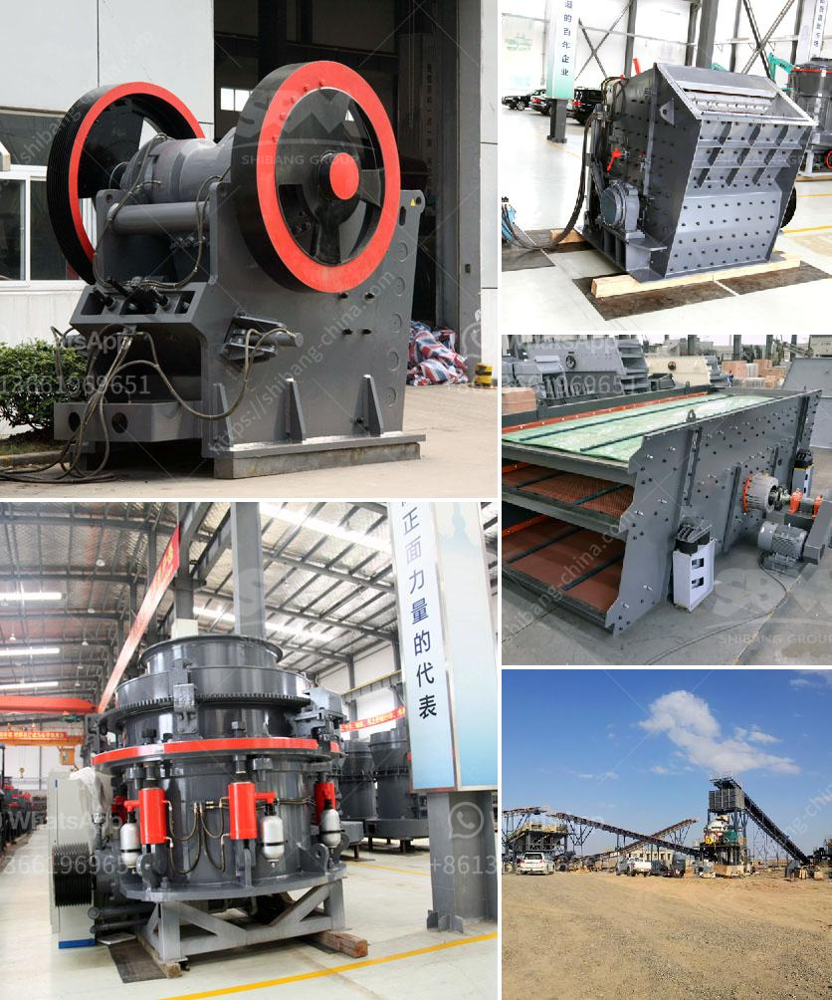

<h3>used small stone crusher mill california</h3>
The small stone crusher mill California is an essential piece of equipment for any mining or quarrying operation. Used to break rock and stone into smaller sizes, this machine has been widely used by miners for decades. It is an efficient and cost-effective way to process materials and produce the desired product.

There are several advantages to using a small stone crusher mill in California. One of the main benefits is its size. These machines can easily fit into tight spaces, making them ideal for small-scale operations. They are also portable, which means they can be transported to different locations as needed. This versatility allows miners to move the equipment closer to the extraction site, minimizing transportation costs.

Another advantage of the small stone crusher mill California is its efficiency. These machines are designed to crush the material into smaller sizes in a single pass, reducing the need for multiple stages of crushing. This not only saves time but also reduces energy consumption, making it more economical to operate. Additionally, the crusher mill is designed to produce uniform-sized particles, ensuring a consistent final product.

Cost is also a significant factor when considering the use of a small stone crusher mill California. These machines are generally more affordable compared to larger crushers and mills. This makes them an attractive option for small-scale miners or those with limited budgets. Additionally, the operating costs, including maintenance and repairs, are relatively low, further reducing the overall cost of ownership.

In conclusion, the small stone crusher mill California is a valuable piece of equipment for any mining or quarrying operation. Its small size, portability, efficiency, and cost-effectiveness make it an ideal choice for small-scale operations. With proper maintenance and care, this machine can provide years of reliable service, helping miners extract and process rock and stone efficiently.
<h3>Contact us</h3><ul><li><strong>Whatsapp:&nbsp;<a href="https://wa.me/8613661969651">+8613661969651</a></strong></li><li><a href="https://swt.shibang-china.com/?git&amp;zhl&amp;used small stone crusher mill california"><strong>Online Service(chat now)</strong></a></li></ul><h3>Related</h3><ul><li><a href='crusher machine kenya.md'>crusher machine kenya</a></li><li><a href='gypsum mill production.md'>gypsum mill production</a></li><li><a href='dolomite stone crusher plant.md'>dolomite stone crusher plant</a></li><li><a href='raymond grinder pakistan.md'>raymond grinder pakistan</a></li><li><a href='movable stone crusher.md'>movable stone crusher</a></li></ul>