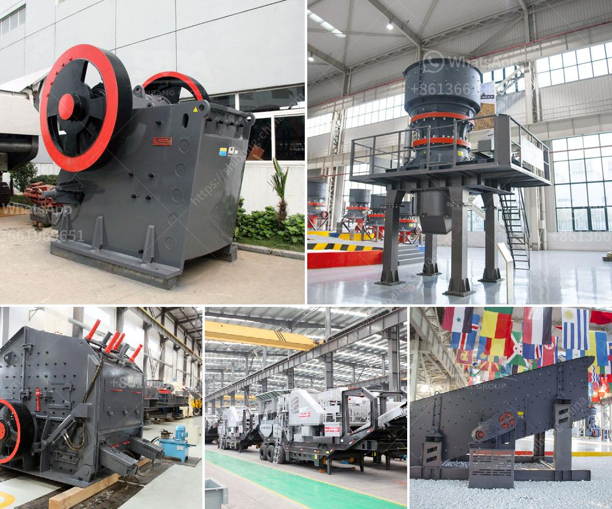

<h3>used stone crasher machine for sale</h3>
Stone crushers are commonly used in various industries such as mining, smelting, building materials, highways, railways, water conservancy, and chemical industries. There is a large demand for stone crasher machines due to the benefits it provides in terms of efficiency, cost-effectiveness, and durability. The used stone crusher machine for sale offers numerous advantages over new ones, helping businesses save even more money while providing the same or even better quality.

One of the primary reasons to consider purchasing a used stone crusher machine is its lower upfront cost compared to new equipment. With new machinery, manufacturers factor in the costs of research and development, testing, production, and marketing, all of which are passed onto the buyer. On the other hand, used stone crasher machines are readily available on the market with lower price tags. This makes them an attractive option for businesses looking to save on their initial investment.

Another advantage of buying a used stone crusher machine is that you can evaluate its performance based on its previous owners. The history of the machine can help you get a better understanding of how it has been maintained and operated. By assessing its maintenance records and checking for any reported issues, you can rest assured that you are investing in a reliable piece of equipment.

Moreover, used stone crusher machines often come with added benefits in terms of additional attachments or accessories that may not be readily available with new equipment. These extra features can include items like spare parts, hammers, screens, and other components that can enhance the functionality and productivity of the stone crusher machine. By purchasing a used one, you may gain access to these valuable extras, saving you both time and money in the long run.

The resale value of used stone crusher machines is also an advantage to consider. If you decide to upgrade to a newer model in the future, selling your used machine can help you recoup a significant portion of your initial investment. Stone crushers tend to have a relatively high demand, ensuring that there is a market for used equipment. Proper maintenance and regular servicing can even help retain the value of the machine over time.

When looking for a used stone crusher machine for sale, it is important to understand that the seller should provide all the necessary information relating to the machine and its condition. This includes detailed specifications, maintenance records, and any repairs or refurbishments carried out. It is advisable to physically inspect the machine before finalizing the purchase to ensure that it meets your requirements and is in good working condition.

In conclusion, opting for a used stone crasher machine can be a cost-effective solution for businesses in need of stone crushing equipment. With lower upfront costs, access to additional attachments, and potential resale value, used machines offer various advantages. However, it is crucial to do thorough research, evaluate the machine's history, and conduct a physical inspection to ensure a wise investment.
<h3>Contact us</h3><ul><li><strong>Whatsapp:&nbsp;<a href="https://wa.me/8613661969651">+8613661969651</a></strong></li><li><a href="https://swt.shibang-china.com/?git&amp;zhl&amp;used stone crasher machine for sale"><strong>Online Service(chat now)</strong></a></li></ul><h3>Related</h3><ul><li><a href='gypsum processing plant.md'>gypsum processing plant</a></li><li><a href='double stage hammer crusher for stone.md'>double stage hammer crusher for stone</a></li><li><a href='used portable impact crusher for sale in uae.md'>used portable impact crusher for sale in uae</a></li><li><a href='belt price conveyor belt price malaysia.md'>belt price conveyor belt price malaysia</a></li><li><a href='steel rolling mill project cost in india.md'>steel rolling mill project cost in india</a></li></ul>