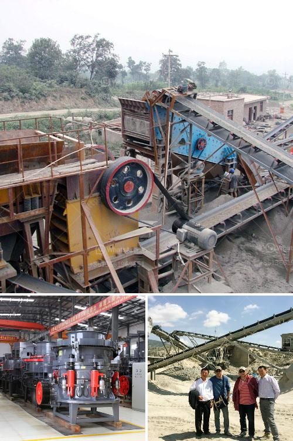

<h3>used stone crusher for sale in india</h3>
With the rapid development of economy, India is now the second largest producer of stone in the world. That’s why this country is a huge potential market for the used stone crusher industry. India is a major mineral producer in Asia and globally. It is currently a global producer of chromite, coal, iron ore and bauxite. India has been enjoying economic growth during the nineties. And stone crusher is one such industry that exists in the vicinity of almost all major cities/towns throughout the country in all the states because the construction activities go on throughout the country.

For the used stone crusher, the quality and performance of the equipment are important. The last thing you want to do is invest in a machine that does not meet your expectations and needs. That is why you should take some time to do some research online to find out what people are saying about a particular machine before you buy it. A stone crusher is a machine designed to reduce large rocks into smaller rocks, gravel or rock dust. Crushers may be used to reduce the size or change the form of waste materials, so they can be more easily disposed of or recycled or to reduce the size of a solid mix of raw materials, so that pieces of different composition can be differentiated. Crushing is the process of transferring a force amplified by mechanical advantage through a material made of molecules that bond together more strongly, and resist deformation more, than those in the material being crushed do.

Used stone crushers have a wide range of applications in India industry. Some of them are used for decorative purposes and some are used to produce a variety of products. The crushers can be divided into various models, such as mobile crusher, jaw crusher, impact crusher, cone crusher, etc. India has a wealthy reserve of iron ore. Therefore, many Indian businessmen buy second-hand portable crushers to crush large-scale ore materials to make money off the sale.

By now, the crushing industry has been developed well due to the advanced technologies of used stone crushers. In addition, there are many used stone crushers in South Africa, which also attract many users to buy these machines after all, South Africa is a country rich in materials, so these used stone crushers are popular in South Africa, stationary? and mobile? crushers, both are available on the market. To conclude, stone crusher is able to crush a variety of materials with different hardness levels. The machine has the advantage of high output, high efficiency, and easy maintenance. Therefore, it has a high demand in the market for both primary and secondary crushing.
<h3>Contact us</h3><ul><li><strong>Whatsapp:&nbsp;<a href="https://wa.me/8613661969651">+8613661969651</a></strong></li><li><a href="https://swt.shibang-china.com/?git&amp;zhl&amp;used stone crusher for sale in india"><strong>Online Service(chat now)</strong></a></li></ul><h3>Related</h3><ul><li><a href='grinding marble stone price.md'>grinding marble stone price</a></li><li><a href='price of stone crusher from china.md'>price of stone crusher from china</a></li><li><a href='limestone crushing processing for the manufacture.md'>limestone crushing processing for the manufacture</a></li><li><a href='grinding machine information in hindi.md'>grinding machine information in hindi</a></li><li><a href='silica powder grinding machine.md'>silica powder grinding machine</a></li></ul>