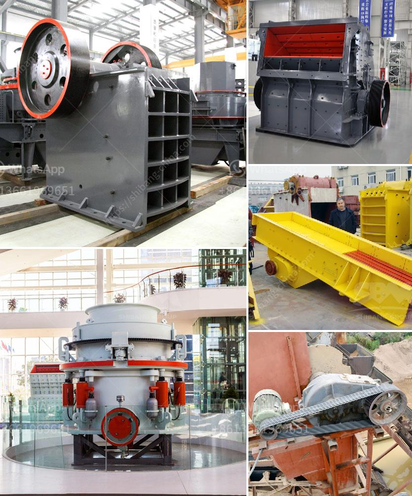

<h3>used stone crusher in germany for sale</h3>
Stone crushing industry is an important industrial sector engaging in producing crushed stones, which are raw materials for various construction activities like building roads, highways, bridges, buildings, canals, etc. The German economy has been heavily reliant on the mining industry, and stone crushing remains a prominent activity in the country.

Germany has advanced technological and engineering prowess, making it a technology-driven country. Now, the country is considered a global leader in many sectors, including the mining and construction industry. By harnessing the potential of various resources, Germany today stands as one of the major hubs for the sale and purchase of used stone crushers.

Germany, with its prosperous economy and high living standards, is a preferred destination for many investors worldwide. In recent years, the German construction industry has experienced a boost, due to increased government spending on infrastructure projects. These factors have resulted in a steady demand for stone crushers.

The market for used stone crushers in Germany is relatively competitive. The used stone crusher market faces a constant potential for technological innovation with the utilization of new techniques to enhance productivity and reduce operating costs. Additionally, government regulations and policies favoring the recycling and reuse of construction aggregates are creating a significant demand for used stone crushers in Germany.

1. Economical: Used stone crushers in Germany ensure optimal efficiency and low operating costs for major construction projects.

2. Versatility: Stone crushers are used for crushing various materials, ranging from hard stones to soft materials, such as river pebbles, basalt, limestone, granite, etc.

3. Flexibility: Stone crushers can be adapted seamlessly to different environments, even in places where space is limited, eliminating the need for additional machinery.

4. Environmental friendliness: The use of recycled aggregates reduces the demand for fresh extraction, preserving natural resources and reducing carbon emissions.

5. Easy maintenance: Most used stone crushers in Germany are simple in design and easy to operate. They offer a high degree of reliability and require minimum maintenance.

Used stone crushers in Germany have a long history of reliable operation and high productivity. Recognizing the importance of quality, German construction companies are increasingly investing in high-quality used stone crushers. New techniques for crushing and grinding stones are being introduced, allowing companies to save both time and resources.

Moreover, used stone crushers in Germany can ensure procedure reliability, reducing time spent on maintenance and repairs. Alongside these benefits, increasing government initiatives favoring the use of recycled aggregates are expected to boost the demand for used stone crushers.

It is safe to conclude that the demand for used stone crushers in Germany is expected to grow with the country's continued construction boom. Moreover, technological advancements and favorable government policies will contribute to the growth of the used stone crusher market, facilitating sustainable development in the construction industry.
<h3>Contact us</h3><ul><li><strong>Whatsapp:&nbsp;<a href="https://wa.me/8613661969651">+8613661969651</a></strong></li><li><a href="https://swt.shibang-china.com/?git&amp;zhl&amp;used stone crusher in germany for sale"><strong>Online Service(chat now)</strong></a></li></ul><h3>Related</h3><ul><li><a href='total costing of stone crusher in maharashtra.md'>total costing of stone crusher in maharashtra</a></li><li><a href='looking for used pulverizer machine.md'>looking for used pulverizer machine</a></li><li><a href='used mining equipment uk.md'>used mining equipment uk</a></li><li><a href='jaw crusher harga.md'>jaw crusher harga</a></li><li><a href='calcium carbonate powder processing plant.md'>calcium carbonate powder processing plant</a></li></ul>