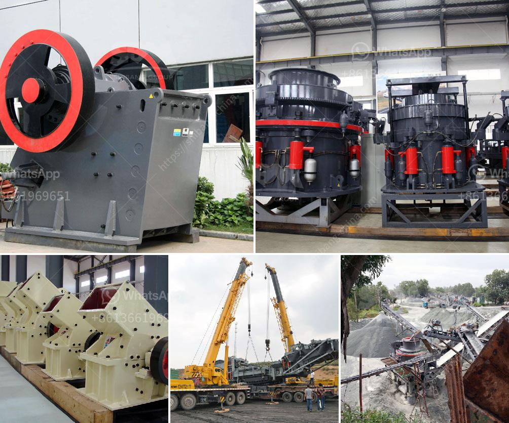

<h3>used vertical grinder mill for sale</h3>
If you are in the market for a grinder mill for your industrial needs, you may want to consider purchasing a used vertical grinder mill. These machines are widely used in various industries such as mining, construction, and metalworking, and offer several advantages over other types of grinder mills.

One of the main advantages of a vertical grinder mill is its compact design. Unlike horizontal mills, which have a larger footprint, vertical mills can fit into smaller spaces, making them ideal for facilities with limited floor space. Additionally, vertical mills are known for their versatility and can be used for a wide range of materials, including metals, minerals, and even grains.

Another benefit of a used vertical grinder mill is its cost-effectiveness. Used machinery is generally more affordable compared to new ones, making it an attractive option for businesses looking to save money. Additionally, buying a used machine allows you to acquire a high-quality industrial grinder at a fraction of the cost, potentially increasing your return on investment.

When purchasing a used vertical grinder mill, it is important to consider the machine's condition. Look for a reputable seller or dealer that offers inspection and certification to ensure that the machine is in good working order. You can also check for any warranty or after-sales support that may be available.

In conclusion, if you are in need of a grinder mill for your industrial operations, a used vertical grinder mill can be a cost-effective and versatile option. With its compact design and wide range of applications, this machine can efficiently process various materials. However, ensure that you are purchasing from a trusted source and inspect the machine's condition before making a decision.
<h3>Contact us</h3><ul><li><strong>Whatsapp:&nbsp;<a href="https://wa.me/8613661969651">+8613661969651</a></strong></li><li><a href="https://swt.shibang-china.com/?git&amp;zhl&amp;used vertical grinder mill for sale"><strong>Online Service(chat now)</strong></a></li></ul><h3>Related</h3><ul><li><a href='double roller crusher manufacturer.md'>double roller crusher manufacturer</a></li><li><a href='sand screening machine.md'>sand screening machine</a></li><li><a href='cost of conveyor belts.md'>cost of conveyor belts</a></li><li><a href='stone crushing machine factories in shanghai.md'>stone crushing machine factories in shanghai</a></li><li><a href='second hand ball mill europe.md'>second hand ball mill europe</a></li></ul>