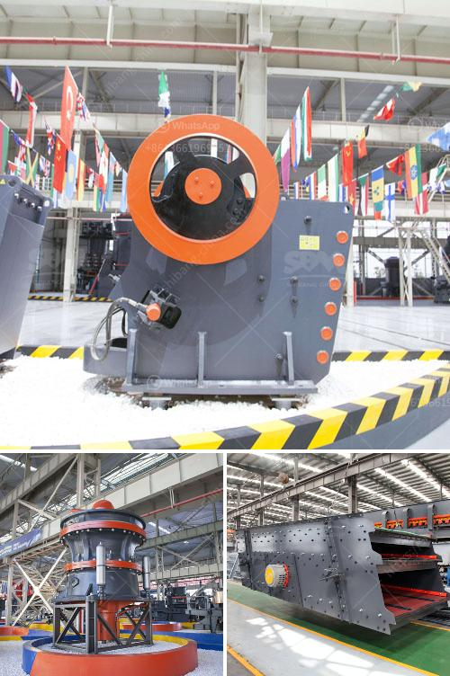

<h3>vertical cement mill</h3>
In the cement production process, vertical cement mill plays an important role. It is widely used in cement, electric power, metallurgy, chemical, and other industries to grind all kinds of cement clinker and other materials. However, due to various factors, the service life of the vertical cement mill is affected, and thus, the output and quality of cement are adversely affected. This article will analyze the main factors affecting the vertical cement mill and provide feasible solutions.

One of the factors affecting the vertical cement mill is the temperature of the clinker. When the clinker's temperature is too high, it will cause the grinding roller and millstone's rapid wear and even deformation, leading to insufficient grinding efficiency. In this case, a suitable amount of water spray can be added to the mill's feeding end or hydraulic system to reduce the clinker's temperature and enhance the grinding efficiency.

Another factor affecting the vertical cement mill is the hardness of the raw material. When the hardness of the raw material is too high, it will cause excessive wear on the grinding roller and millstone, increasing the maintenance cost and reducing the service life of the mill. To solve this problem, the choice of grinding roller and millstone material should be considered. The use of wear-resistant materials can effectively extend the mill's service life and reduce production costs.

The third factor affecting the vertical cement mill is the feeding size. When the raw material's size is too large, the vertical cement mill will not be able to effectively grind, resulting in low grinding efficiency and high energy consumption. In this case, the raw material should be crushed before entering the mill to meet the requirements of the mill's feeding size. Additionally, the uniformity of the feeding size should be ensured to avoid the phenomenon of ball locking or material accumulation.

Furthermore, the moisture content of the raw material is also a significant factor affecting the vertical cement mill. When the moisture content of the raw material is too high, it will cause the material to adhere to the grinding roller and millstone, leading to blockage and reduced grinding efficiency. To solve this problem, the moisture content of the raw material should be strictly controlled. If necessary, a drying system can be added to reduce the moisture content before entering the mill.

In conclusion, various factors can affect the vertical cement mill's performance, including the temperature of the clinker, the hardness of the raw material, the feeding size, and the moisture content. By implementing suitable solutions, such as adding water spray, choosing wear-resistant materials, crushing the raw material, and controlling the moisture content, the vertical cement mill's efficiency can be improved, leading to better cement quality and output. It is important for cement manufacturers to pay attention to these factors and continuously optimize their production processes to achieve maximum performance.
<h3>Contact us</h3><ul><li><strong>Whatsapp:&nbsp;<a href="https://wa.me/8613661969651">+8613661969651</a></strong></li><li><a href="https://swt.shibang-china.com/?git&amp;zhl&amp;vertical cement mill"><strong>Online Service(chat now)</strong></a></li></ul><h3>Related</h3><ul><li><a href='stone crushing machine factories in shanghai.md'>stone crushing machine factories in shanghai</a></li><li><a href='conveyor belts in port system.md'>conveyor belts in port system</a></li><li><a href='belt conveyor supplier in china.md'>belt conveyor supplier in china</a></li><li><a href='chrome beneficiation plant design.md'>chrome beneficiation plant design</a></li><li><a href='crusher peru price.md'>crusher peru price</a></li></ul>