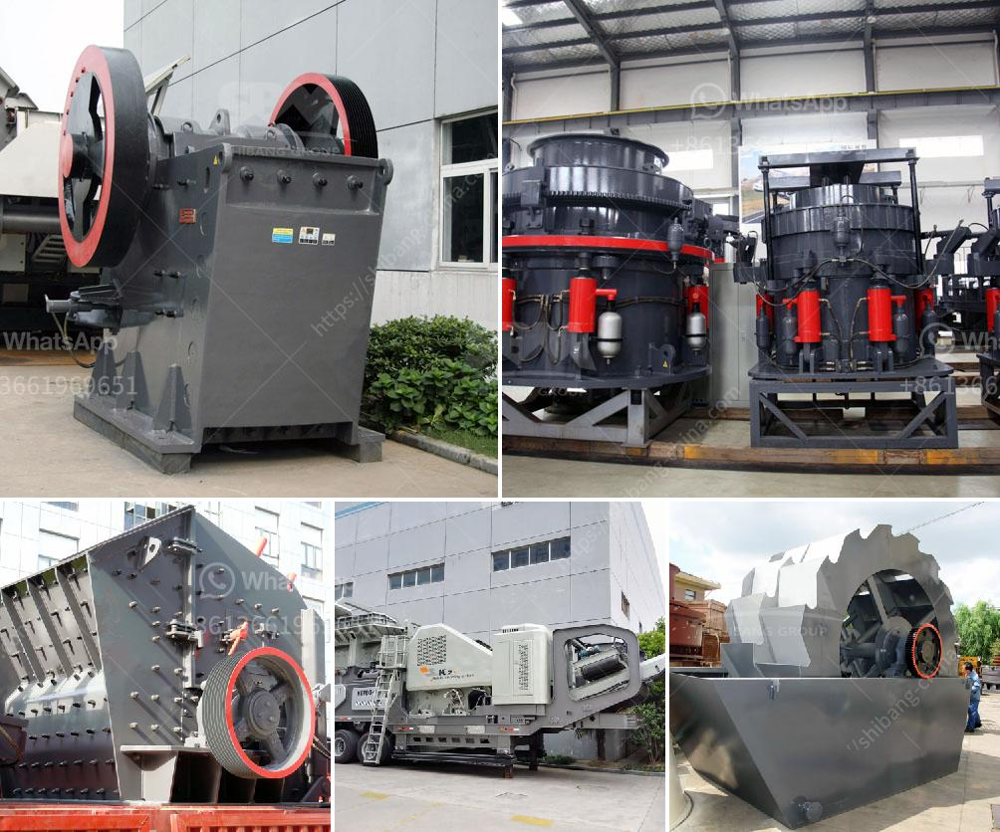

<h3>vertical grinder mill for sale</h3>
Vertical grinder mills are highly efficient machines that are widely used in the industrial sector for grinding raw materials into fine powders. These mills utilize a rotating grinding disc to vertically grind materials, providing a consistent and controlled grind. With the growing demand for powdered materials in various industries such as cement, mining, and chemical processing, the vertical grinder mill is becoming an essential equipment for businesses.

One of the significant advantages of vertical grinder mills is their compact design, which allows for easy installation and efficient use of space. Unlike horizontal mills, these vertical mills have a smaller footprint, making them ideal for factories with limited space. Additionally, their vertical orientation enables a continuous flow of materials, increasing productivity and reducing grinding time.

Moreover, vertical grinder mills are known for their high grinding efficiency. The grinding disc, mounted vertically, provides a larger grinding surface area compared to traditional horizontal mills, allowing for faster and finer grinding. This results in a more consistent and uniform grind, leading to improved product quality.

Furthermore, vertical grinder mills offer the benefit of adjustable grinding fineness. The ability to control the fineness of the grind ensures that the end product meets the required specifications. This versatility makes vertical grinder mills suitable for a wide range of applications, from producing fine powders for pharmaceuticals to coarse grinds for construction materials.

In terms of maintenance, vertical grinder mills are designed for easy access and inspection, minimizing downtime for repairs and maintenance tasks. With proper care, these mills can operate efficiently for extended periods, contributing to cost savings and reduced maintenance expenses.

Overall, the vertical grinder mill is a valuable asset for businesses in need of a reliable and efficient grinding solution. Its compact design, high grinding efficiency, and adjustable fineness make it a versatile machine suitable for various industries. If you are looking for a low-maintenance, space-saving, and highly efficient grinding solution, consider investing in a vertical grinder mill.
<h3>Contact us</h3><ul><li><strong>Whatsapp:&nbsp;<a href="https://wa.me/8613661969651">+8613661969651</a></strong></li><li><a href="https://swt.shibang-china.com/?git&amp;zhl&amp;vertical grinder mill for sale"><strong>Online Service(chat now)</strong></a></li></ul><h3>Related</h3><ul><li><a href='clay mill machine crusher price.md'>clay mill machine crusher price</a></li><li><a href='granite quarry business plan pdf.md'>granite quarry business plan pdf</a></li><li><a href='pioneer ft impact crusher.md'>pioneer ft impact crusher</a></li><li><a href='project cost of mini clinker grinding plant.md'>project cost of mini clinker grinding plant</a></li><li><a href='ball mill hammer mill roller mill machine.md'>ball mill hammer mill roller mill machine</a></li></ul>