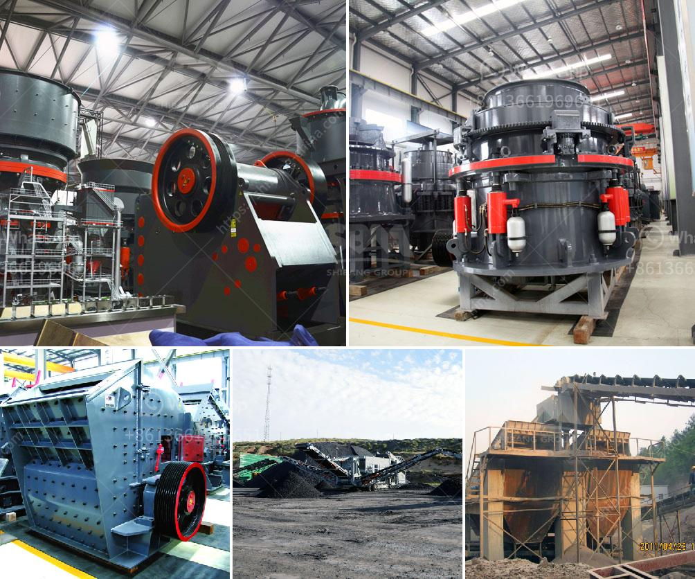

<h3>vertical grinder mill price</h3>
Vertical grinder mill is a commonly used grinding equipment in the industrial field. With the continuous development of the market economy and the improvement of technology, the vertical grinder mill has been continuously upgraded and improved. As a result, the price of vertical grinder mill has become a concern for many buyers. In this article, we will analyze the factors that affect the price of vertical grinder mill.

Firstly, the brand of vertical grinder mill is a significant factor that determines its price. Well-known brands usually have higher prices due to their reputation and the quality assurance they provide. These brands often invest a large amount of capital in research and development, and their products are more reliable and durable. Therefore, the price of vertical grinder mill from well-known brands is generally higher.

Secondly, the production cost is also an important factor affecting the price. The production cost includes the cost of raw materials, labor, and other production overheads. The high-quality materials used in the manufacturing process, such as alloy steel for grinding roller and ring, will increase the cost. In addition, the more skilled and experienced workers required for the production, the higher the labor cost. Therefore, the higher the production cost, the higher the price of the vertical grinder mill.

Thirdly, the size and capacity of the grinder mill also affect its price. The size and capacity of the grinder mill determine the amount of material it can process in a given time, as well as its versatility and adaptability to various materials. Generally, larger and higher-capacity grinder mills are more expensive because they require more materials and have more complex mechanical structures.

Furthermore, the after-sales service provided by the manufacturer also affects the price of the vertical grinder mill. Manufacturers that provide comprehensive and efficient after-sales service usually charge a higher price. This is because they have a professional team to provide technical support, repair and maintenance services, and spare parts supply. With good after-sales service, buyers can use the vertical grinder mill more safely and have a longer service life.

Finally, market supply and demand play a role in determining the price of vertical grinder mill. When the market demand is high and the supply is limited, the price of the vertical grinder mill will be higher. Conversely, when the market demand is low and the supply is sufficient, the price will be relatively lower. In addition, market competition also affects the price. If there are many manufacturers in the market, they will compete with each other to attract buyers by offering lower prices.

In conclusion, the price of vertical grinder mill is influenced by various factors. These include the brand, production cost, size and capacity, after-sales service, and market supply and demand. Buyers should consider these factors and choose a vertical grinder mill that meets their requirements and budget. It is recommended to compare prices from different manufacturers and choose a reliable and reputable brand to ensure both quality and affordability.
<h3>Contact us</h3><ul><li><strong>Whatsapp:&nbsp;<a href="https://wa.me/8613661969651">+8613661969651</a></strong></li><li><a href="https://swt.shibang-china.com/?git&amp;zhl&amp;vertical grinder mill price"><strong>Online Service(chat now)</strong></a></li></ul><h3>Related</h3><ul><li><a href='sand core machine manufacturers.md'>sand core machine manufacturers</a></li><li><a href='feldspar milling market.md'>feldspar milling market</a></li><li><a href='buyers ball mill process.md'>buyers ball mill process</a></li><li><a href='raymond mill for sale second hand.md'>raymond mill for sale second hand</a></li><li><a href='automation conveyor belts.md'>automation conveyor belts</a></li></ul>