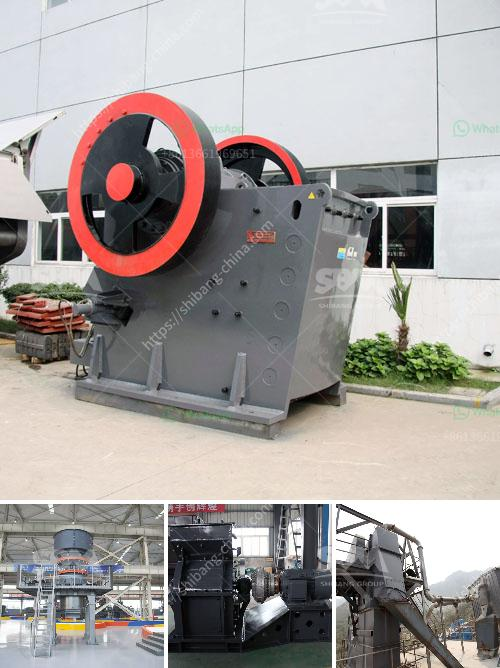

<h3>vertical mill for sale</h3>
When it comes to milling machines, vertical mills are among the most popular and versatile options available in the market today. With their ability to handle a wide range of materials and offer precise cutting capabilities, vertical mills have become indispensable tools for various industries, including manufacturing, metalworking, and woodworking.

If you are considering purchasing a vertical mill for your business or personal use, you will be pleased to know that there is an excellent selection of vertical mills for sale. These machines are designed to deliver exceptional performance and durability, making them a worthwhile investment for any workshop or job site.

One of the key advantages of vertical mills is their ability to perform both intricate and heavy-duty machining tasks. The vertical spindle orientation allows for precise cutting, drilling, and milling operations, ensuring a high level of accuracy and repeatability. Additionally, vertical mills can handle a wide variety of materials, including metals, plastics, wood, and composites, making them suitable for almost any project.

Another essential feature of vertical mills is their versatility. These machines typically come with multiple speed settings and adjustable table heights, allowing operators to work with different materials and achieve the desired results. Furthermore, vertical mills often include various accessories and attachments, such as rotary tables and dividing heads, which further expand their capabilities and enhance their efficiency.

To ensure that you find the perfect vertical mill for your needs, it is recommended to explore a wide range of options available in the market. From compact benchtop models to heavy-duty industrial-grade machines, there is a vertical mill for sale to suit every budget and requirement. Consider your specific machining needs, available space, and budgetary constraints when making your selection.

In conclusion, vertical mills offer exceptional cutting capabilities and versatility, making them invaluable tools for a variety of industries. With numerous options available in the market, finding the right vertical mill for sale is easier than ever. Invest in a high-quality vertical mill, and witness the significant improvements in your machining operations.
<h3>Contact us</h3><ul><li><strong>Whatsapp:&nbsp;<a href="https://wa.me/8613661969651">+8613661969651</a></strong></li><li><a href="https://swt.shibang-china.com/?git&amp;zhl&amp;vertical mill for sale"><strong>Online Service(chat now)</strong></a></li></ul><h3>Related</h3><ul><li><a href='principle of roller mill.md'>principle of roller mill</a></li><li><a href='hydraulic concrete crusher rent mn.md'>hydraulic concrete crusher rent mn</a></li><li><a href='cone crusher instructions.md'>cone crusher instructions</a></li><li><a href='raymond mill micro pulverizer.md'>raymond mill micro pulverizer</a></li><li><a href='graphite production machine.md'>graphite production machine</a></li></ul>