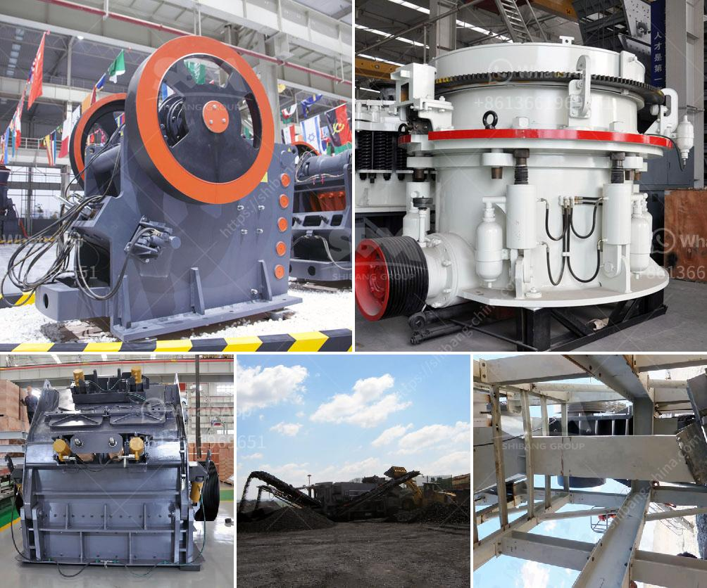

<h3>vertical shaft impact crusher</h3>
The vertical shaft impact crusher is a commonly used sand production equipment in the sand production line. It is very important for the sand making process. The vertical shaft impact crusher has high production efficiency, but after a period of use, pay attention to regular maintenance and timely replacement of wearing parts, so as to ensure the smooth production process of the sand making machine. This article will introduce you to the maintenance of the vertical shaft impact crusher.

1. Regularly inspect the wearing parts: The vertical shaft impact crusher is composed of many parts, and each of the components plays a vital role in the production process. Therefore, it is necessary to regularly inspect the wearing parts and replace them in time if they are damaged, so as not to affect the normal operation of the machine.

2. Regularly check the lubrication system: The lubrication system plays a key role in the operation of the vertical shaft impact crusher. If the lubricating oil is not added in time or the number of refuel is insufficient, it will directly affect the bearing life and cause equipment failure. Therefore, in order to ensure the normal operation of the sand making machine, it is necessary to regularly check the lubrication system and add lubricant in time.

3. Maintain a reasonable feeding speed: Appropriate feeding speed can not only ensure the smooth production of the sand making machine, but also prevent the equipment from being overloaded and damaged. Therefore, during the use of the vertical shaft impact crusher, pay attention to maintaining a reasonable feeding speed and avoid excessive feeding.

4. Regularly check the tightness of the belt: The belt drive of the vertical shaft impact crusher is an important transmission part, and the tightness directly affects the production efficiency of the equipment. If the tightness of the belt is not suitable, it may cause slipping or even damage the belt. Therefore, it is necessary to regularly check the belt tightness and adjust it in time.

5. Regularly check the voltage and current: The voltage and current are important parameters for the normal operation of the vertical shaft impact crusher. If the voltage is too low or the current is too high, it may cause the motor to burn out or the equipment to malfunction. Therefore, it is necessary to regularly check the voltage and current, and ensure that the parameters are within the normal range.

In conclusion, the maintenance of the vertical shaft impact crusher is very important. Regular inspection of the wearing parts, regular inspection of the lubrication system, maintenance of a reasonable feeding speed, regular checking of the belt tightness, and regular checking of the voltage and current can effectively ensure the smooth production process of the sand making machine and prolong its service life.
<h3>Contact us</h3><ul><li><strong>Whatsapp:&nbsp;<a href="https://wa.me/8613661969651">+8613661969651</a></strong></li><li><a href="https://swt.shibang-china.com/?git&amp;zhl&amp;vertical shaft impact crusher"><strong>Online Service(chat now)</strong></a></li></ul><h3>Related</h3><ul><li><a href='jaw crusher specification for activated carbon.md'>jaw crusher specification for activated carbon</a></li><li><a href='quartz stone dust equipment.md'>quartz stone dust equipment</a></li><li><a href='study of a fero chrome crushing plant.md'>study of a fero chrome crushing plant</a></li><li><a href='aggregate production.md'>aggregate production</a></li><li><a href='fine powder grinding machine philippines.md'>fine powder grinding machine philippines</a></li></ul>