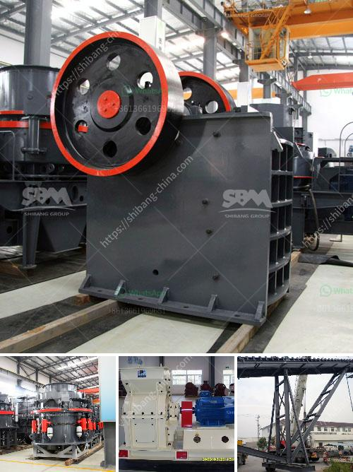

<h3>vertical ultra fine pulverizer</h3>
The vertical ultra fine pulverizer is a cutting-edge technology that brings efficiency and precision to the field of pulverization. With its advanced design and ability to produce ultra-fine and uniform particle sizes, this machine has become indispensable in various industries, including pharmaceuticals, chemicals, and food processing.

One of the key features of the vertical ultra fine pulverizer is its vertical design. Unlike traditional horizontal pulverizers, this technology operates vertically, which allows for higher capacity and improved reliability. The vertical configuration also enables the machine to have a smaller footprint, making it ideal for space-constrained environments.

Another significant advantage of the vertical ultra fine pulverizer is its ability to produce ultra-fine particle sizes. With its precise control over grinding parameters, this machine can achieve particle sizes as low as a few micrometers. This level of fineness is crucial in industries like pharmaceuticals and cosmetics, where uniform particle sizes are essential for product quality and effectiveness.

The vertical ultra fine pulverizer also offers superior energy efficiency compared to traditional pulverizers. Its vertical design and specialized grinding mechanism reduce energy consumption, resulting in cost savings and environmental benefits. Additionally, the machine's high-speed rotation and efficient classification system ensure maximum utilization of raw materials, further enhancing its energy efficiency.

Furthermore, the vertical ultra fine pulverizer provides excellent product consistency and reproducibility. With its precise control over grinding parameters, operators can achieve uniform particle sizes consistently, reducing batch-to-batch variations. This level of precision is crucial for industries that require strict quality control, such as pharmaceuticals and food processing.

Maintenance and cleaning of the vertical ultra fine pulverizer are also convenient and time-saving. Its vertical design allows for easy access to internal parts, simplifying maintenance procedures. Moreover, the machine's specialized grinding mechanism minimizes material residue, making cleaning quick and hassle-free.

In conclusion, the vertical ultra fine pulverizer is a game-changer in the field of pulverization. Its advanced design, ability to produce ultra-fine particle sizes, energy efficiency, and excellent product consistency make it an indispensable tool in various industries. Whether it's pharmaceuticals, chemicals, or food processing, this machine delivers precision and efficiency, allowing businesses to stay competitive in today's demanding market.
<h3>Contact us</h3><ul><li><strong>Whatsapp:&nbsp;<a href="https://wa.me/8613661969651">+8613661969651</a></strong></li><li><a href="https://swt.shibang-china.com/?git&amp;zhl&amp;vertical ultra fine pulverizer"><strong>Online Service(chat now)</strong></a></li></ul><h3>Related</h3><ul><li><a href='jual mesin hammer mill crusher for sale.md'>jual mesin hammer mill crusher for sale</a></li><li><a href='screen vibrating screen for sand.md'>screen vibrating screen for sand</a></li><li><a href='stone crusher machine in nigeria.md'>stone crusher machine in nigeria</a></li><li><a href='limestone rock crushing.md'>limestone rock crushing</a></li><li><a href='nigeria jaw crusher.md'>nigeria jaw crusher</a></li></ul>