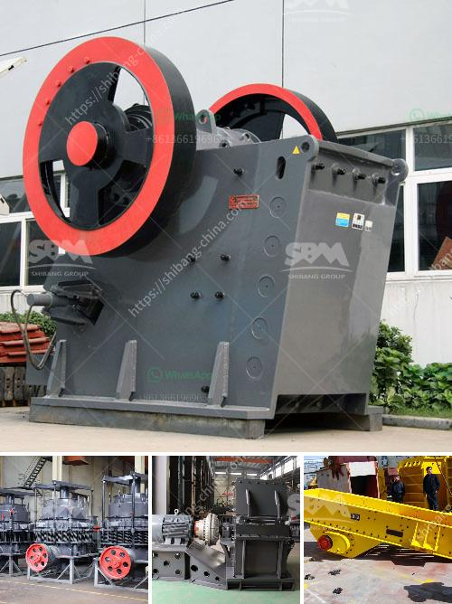

<h3>vibrating feeder screen</h3>
In industrial operations, the processing and handling of various materials such as ores, minerals, coal, aggregates, and chemicals require the use of equipment that can effectively and efficiently separate and sort them. One such equipment that plays a crucial role in these operations is a vibrating feeder screen.

A vibrating feeder screen, also known as a vibratory screen, is a versatile tool used in various industries to sort and separate materials based on their sizes and properties. It consists of a vibrating motor that causes the screen to vibrate, allowing the smaller particles to pass through the screen while larger particles are retained on the screen surface.

The vibrating feeder screen is especially useful in bulk material handling processes, where large quantities of materials need to be sorted and processed efficiently. Whether it is in mining, construction, recycling, or any other industry, this equipment provides numerous benefits that enhance the overall efficiency and profitability of the operation.

One of the key advantages of using a vibrating feeder screen is its ability to handle a wide range of materials. From fine powders to large chunks, this equipment can effectively separate them into different sizes, ensuring that the materials are appropriately processed and used for their intended purposes. This versatility makes the vibrating feeder screen an essential tool in a variety of industries.

Efficiency is another notable benefit offered by the vibrating feeder screen. Its design ensures that the materials are evenly distributed on the screen surface, maximizing the use of available screen area. This uniform distribution prevents clogging and ensures that each particle has sufficient screen time, allowing for more accurate and efficient sorting and separation of materials.

Additionally, the vibrating feeder screen allows for adjustable settings, enabling operators to tailor the equipment's performance to specific processing requirements. The frequency and amplitude of the vibrations can be adjusted to achieve the desired level of material separation. By fine-tuning these settings, operators can optimize the equipment's efficiency, reducing downtime and maximizing productivity.

Maintenance and cleaning of the vibrating feeder screen are relatively simple compared to some other types of screening equipment. With fewer moving parts, the risk of mechanical failures and breakdowns is minimized. Furthermore, many modern vibrating feeder screens are designed with easy access to critical components, making maintenance and replacement tasks quick and hassle-free.

In conclusion, the vibrating feeder screen is a valuable tool that enables efficient and accurate sorting and separation of materials in various industries. From mining and processing to recycling and construction, this versatile equipment ensures that materials are sorted according to their sizes and properties, resulting in enhanced productivity and profitability. With its ability to handle a wide range of materials and adjustable settings, the vibrating feeder screen offers a customizable solution for material handling needs. Its simple maintenance and cleaning ensure uninterrupted operations and long-term reliability. As a key component in material processing operations, the vibrating feeder screen continues to play a crucial role in improving overall efficiency and productivity in various industries.
<h3>Contact us</h3><ul><li><strong>Whatsapp:&nbsp;<a href="https://wa.me/8613661969651">+8613661969651</a></strong></li><li><a href="https://swt.shibang-china.com/?git&amp;zhl&amp;vibrating feeder screen"><strong>Online Service(chat now)</strong></a></li></ul><h3>Related</h3><ul><li><a href='jaw crusher each equipment.md'>jaw crusher each equipment</a></li><li><a href='dolomite sand composition.md'>dolomite sand composition</a></li><li><a href='copper processing stages.md'>copper processing stages</a></li><li><a href='fine powder grinding machine philippines.md'>fine powder grinding machine philippines</a></li><li><a href='what is expected cost of 100 tph crushing plant.md'>what is expected cost of 100 tph crushing plant</a></li></ul>