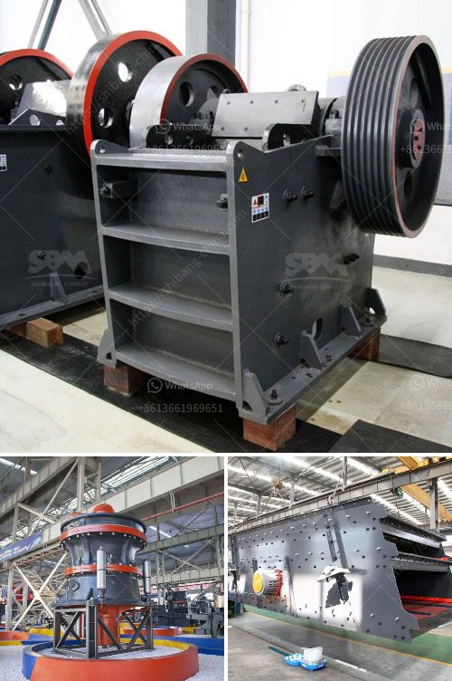

<h3>vibrating screen consumption</h3>
Vibrating screens are extensively used in various industries for separating and classifying materials according to their size. They play a crucial role in production processes, improving efficiency, and ensuring quality control. With advancements in technology and increasing demand in different sectors, the consumption of vibrating screens has witnessed steady growth. In this article, we will delve deeper into the factors driving this consumption and its impact on various industries.

One of the key drivers of vibrating screen consumption is the expanding construction industry. Vibrating screens are widely employed in construction sites for aggregate separation and sizing. As more infrastructure projects are being undertaken globally, the demand for vibrating screens in the construction sector is on the rise. These screens help in separating different types of aggregates, ensuring that only the desired sizes are used in the construction process. This leads to faster and more efficient construction, reducing wastage of materials and costs.

The mining industry is another significant contributor to the consumption of vibrating screens. In the mining sector, these screens are used to separate minerals and ores of different sizes. They are essential for improving the efficiency of the extraction process and ensuring the product quality. With the increase in mining activities worldwide, driven by the growing demand for minerals and metals, the demand for vibrating screens has grown substantially. Vibrating screens play a crucial role in enhancing productivity and reducing downtime in mining operations.

Another factor influencing the consumption of vibrating screens is the recycling industry. As environmental concerns and regulations become more stringent, there is a need for efficient recycling processes. Vibrating screens are used in recycling plants to sort and separate different recyclable materials, such as plastics, metals, and paper. These screens help in achieving higher recycling rates and ensuring the quality of the recycled products. With the emphasis on sustainable practices, the consumption of vibrating screens in the recycling industry is expected to grow further.

The food and beverage industry is also a significant consumer of vibrating screens. These screens are utilized in food processing plants to separate and classify various ingredients and products. They aid in ensuring food safety and quality by removing impurities and foreign materials. With the increasing demand for processed and packaged food products worldwide, the consumption of vibrating screens in the food industry has surged. The screens not only improve the efficiency of production processes but also contribute to maintaining the desired product standards.

In conclusion, the consumption of vibrating screens has been witnessing growth due to various factors. The construction industry, mining sector, recycling industry, and the food and beverage industry are among the leading consumers. As these industries continue to expand, driven by economic development, urbanization, and evolving consumer preferences, the demand for vibrating screens is expected to rise. This presents opportunities for manufacturers and suppliers to innovate and develop advanced technologies to meet the diverse needs of different industries. Furthermore, the adoption of vibrating screens contributes to improved productivity, cost savings, and environmental sustainability, making them an integral part of modern industrial processes.
<h3>Contact us</h3><ul><li><strong>Whatsapp:&nbsp;<a href="https://wa.me/8613661969651">+8613661969651</a></strong></li><li><a href="https://swt.shibang-china.com/?git&amp;zhl&amp;vibrating screen consumption"><strong>Online Service(chat now)</strong></a></li></ul><h3>Related</h3><ul><li><a href='granulator jaw crusher hadfield.md'>granulator jaw crusher hadfield</a></li><li><a href='second hand crushers price in india.md'>second hand crushers price in india</a></li><li><a href='marble powder mill machinery.md'>marble powder mill machinery</a></li><li><a href='grinding mill in china.md'>grinding mill in china</a></li><li><a href='conveyor belt setup china.md'>conveyor belt setup china</a></li></ul>