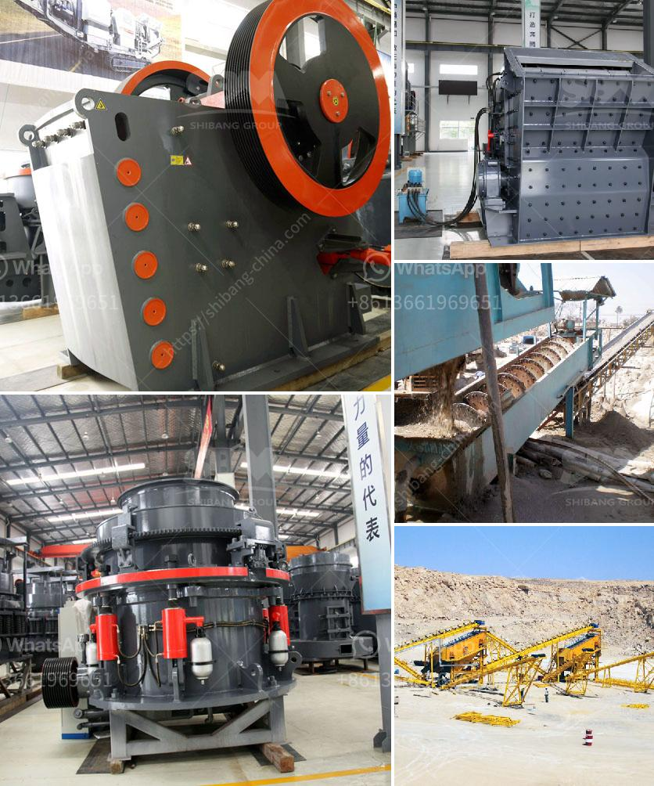

<h3>vibrating screen for crusher plant</h3>
Vibrating screens are a crucial component in stone crushing plants and big mining operations. These screens are typically used to separate rocks, ores, and other materials based on their size, shape, or composition. They are primarily utilized in industries where material handling and processing are essential, such as construction, mining, and recycling.

The main purpose of a vibrating screen in a crushing plant is to separate the valuable materials from the waste so that they can be further processed or used for other purposes. The screening process is crucial for achieving the desired product size and quality, as it ensures that the material meets the requirements for further processing. In addition, it helps to reduce the overall processing time and cost by eliminating unnecessary steps.

There are several types of vibrating screens available for crusher plants, each having its own set of advantages and functions. The most common types include inclined screens, horizontal screens, dewatering screens, and banana screens. Inclined screens are the most basic type, often used in smaller plants or for simple screening operations. They are inclined at an angle and rely on gravity to separate the material.

Horizontal screens, on the other hand, are designed for higher capacity and efficiency. They use a circular motion to move the material along the screen and can handle a larger volume of material. Dewatering screens, as the name suggests, are used to remove excess moisture from the material, ensuring a drier product. Banana screens, which have multiple slopes, are used for high-capacity screening and improved material flow.

One of the key features of vibrating screens is the vibration mechanism. This mechanism creates vibrations that help to separate the material by size. The amplitude and frequency of the vibrations can be adjusted according to the specific requirements of the process or the material being screened. This allows for precise control over the screening process and ensures efficient separation.

In addition to separating the material, vibrating screens also play a role in preventing damage to the crusher and other equipment in the plant. They help to remove oversized rocks or debris that could cause choke-ups or damage during the crushing process. By ensuring that only the desired material enters the crusher, vibrating screens help to extend the lifespan of the equipment and reduce downtime for maintenance and repairs.

In conclusion, vibrating screens are an essential component in crusher plants and mining operations. Their primary function is to separate the valuable materials from the waste, ensuring that only the desired material enters the crusher for further processing. They also help to prevent damage to the equipment and improve overall productivity and efficiency. With various types and configurations available, vibrating screens can be tailored to meet the specific requirements of any crushing plant or mining operation.
<h3>Contact us</h3><ul><li><strong>Whatsapp:&nbsp;<a href="https://wa.me/8613661969651">+8613661969651</a></strong></li><li><a href="https://swt.shibang-china.com/?git&amp;zhl&amp;vibrating screen for crusher plant"><strong>Online Service(chat now)</strong></a></li></ul><h3>Related</h3><ul><li><a href='silica sand washing plant china.md'>silica sand washing plant china</a></li><li><a href='crushing machine manufacturers cape town.md'>crushing machine manufacturers cape town</a></li><li><a href='density of conveyor belts for mining.md'>density of conveyor belts for mining</a></li><li><a href='high pressure grinding roll pictures.md'>high pressure grinding roll pictures</a></li><li><a href='automation conveyor belts.md'>automation conveyor belts</a></li></ul>