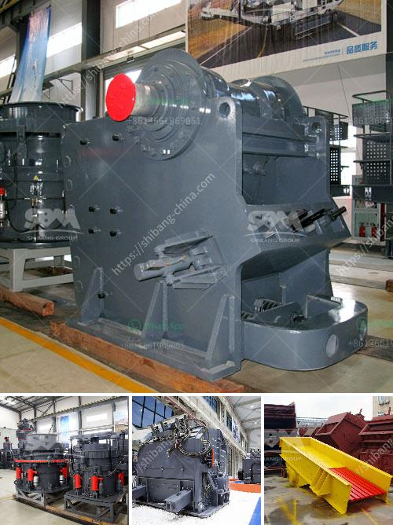

<h3>vibrating screen for silica sand</h3>
Vibrating screens are widely used in the processing of silica sand. With its high screening efficiency and strong vibration force, it is an effective solution for the screening of various ores, including silica sand.

In the silica sand production line, vibrating screen is undoubtedly the key equipment for sieving and grading materials. It not only has a significant impact on the quality of the final product, but also plays a crucial role in the processing of silica sand. The vibrating screen is used to screen the crushed sand into various particle sizes, making it convenient for transportation and further processing.

When the vibrating screen is operating, the material passes through the sieve surface under the action of the exciting force generated by the vibration motor. Due to the high vibration frequency and strong vibration force, the silica sand on the sieve surface quickly jumps forward to achieve efficient screening. The materials that meet the particle size requirements are discharged from the outlet, while the oversized materials are continuously impacted and ground under the action of the vibrating screen, until they are broken into small particles that meet the requirements.

There are several types of vibrating screens suitable for the screening of silica sand, such as linear vibrating screens, circular vibrating screens, and high-frequency vibrating screens. Among them, the linear vibrating screen and the circular vibrating screen are the most commonly used. The linear vibrating screen excites the screen surface with a straight-line motion, while the circular vibrating screen excites the screen surface with a circular motion. The high-frequency vibrating screen uses high-frequency vibration to excite the screen surface, making it highly efficient in the screening of fine materials.

When selecting the vibrating screen for silica sand, it is necessary to determine the appropriate model according to the specific demand. The linear vibrating screen is suitable for screening medium- and fine-grained materials, while the circular vibrating screen is suitable for screening coarse-grained materials. The high-frequency vibrating screen is suitable for screening fine-grained materials with a particle size of 0.074mm or below.

In addition, the structural design of the vibrating screen should also be considered. The sieve plate should have a sufficient mesh size to ensure the screening accuracy, while also having a strong enough load-bearing capacity to withstand the impact of materials. The screen frame should be firm and reliable to ensure long-term stable operation. Moreover, the supporting structure of the vibrating screen should be matched with the actual working conditions to ensure smooth running and reduce vibration noise.

In conclusion, vibrating screens are indispensable equipment in the processing of silica sand. They not only improve the screening efficiency and accuracy, but also enhance the production capacity and product quality. Therefore, choosing the appropriate vibrating screen and optimizing the structural design are essential for achieving efficient screening of silica sand and improving overall production efficiency.
<h3>Contact us</h3><ul><li><strong>Whatsapp:&nbsp;<a href="https://wa.me/8613661969651">+8613661969651</a></strong></li><li><a href="https://swt.shibang-china.com/?git&amp;zhl&amp;vibrating screen for silica sand"><strong>Online Service(chat now)</strong></a></li></ul><h3>Related</h3><ul><li><a href='process of limestone mining to market.md'>process of limestone mining to market</a></li><li><a href='crusher peru price.md'>crusher peru price</a></li><li><a href='design of harmer mill.md'>design of harmer mill</a></li><li><a href='belt conveyor belt suppliers in oman.md'>belt conveyor belt suppliers in oman</a></li><li><a href='vibrating vibrating grizzly feeder capacity.md'>vibrating vibrating grizzly feeder capacity</a></li></ul>