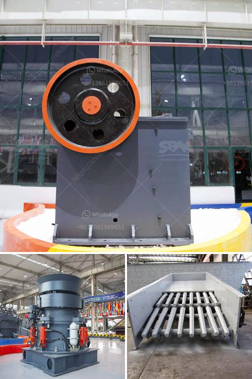

<h3>vibrating screen price</h3>
The vibrating screen is an essential piece of equipment in the mining industry, infrastructure projects, and various other sectors. It is used to separate and classify the materials based on their particle size. Undoubtedly, the price of a vibrating screen plays a crucial role in its popularity among buyers.

When you are looking to purchase a vibrating screen, you need to consider various factors like the size, capacity, and materials used in its construction. However, the price should not be overlooked as it directly affects your purchasing decision. In this article, we will discuss the price range of vibrating screens and the factors that influence it.

The price of a vibrating screen can vary significantly depending on various factors. Generally, the size of the screen determines its price to a large extent. Larger screens with higher capacity will certainly have a higher price compared to smaller screens. The quality and durability of the materials used in its construction also contribute to the cost.

Another factor affecting the price is the brand and reputation of the manufacturer. Well-established manufacturers with a good reputation often charge a premium for their products. This is because they have invested in research and development to improve their designs and use high-quality materials. Their products are known for their robustness and reliability, which justifies the higher price tag.

Additionally, the technological advancements incorporated into the vibrating screens can affect their price. Screens with advanced features like self-cleaning, automated settings, and efficient energy consumption tend to be more expensive. However, these features can improve the overall efficiency and performance of the screen, making them a worthwhile investment.

It is worth mentioning that the price can also fluctuate depending on the region or country where you are purchasing the vibrating screen. Factors like taxes, import duties, and labor costs can vary from one place to another, resulting in price differences. Therefore, it is advisable to compare prices from different suppliers and manufacturers before making a final decision.

While price is an important consideration, it is crucial not to compromise on quality. A vibrating screen is a long-term investment, and opting for a cheaper but inferior product may result in additional maintenance and replacement costs in the future. It is always recommended to choose a screen from a reputable manufacturer, even if it means paying a higher initial price.

In conclusion, when looking to buy a vibrating screen, it is important to consider the price along with other factors like size, capacity, and technological advancements. The price may vary depending on these factors as well as the brand and reputation of the manufacturer. It is advisable to do thorough research, compare prices, and choose a high-quality screen that offers the best value for your investment. Remember, a reliable and durable vibrating screen will contribute to the smooth operation of your business or project in the long run.
<h3>Contact us</h3><ul><li><strong>Whatsapp:&nbsp;<a href="https://wa.me/8613661969651">+8613661969651</a></strong></li><li><a href="https://swt.shibang-china.com/?git&amp;zhl&amp;vibrating screen price"><strong>Online Service(chat now)</strong></a></li></ul><h3>Related</h3><ul><li><a href='mobile screen and crushing.md'>mobile screen and crushing</a></li><li><a href='sand crusher machine hyderabad for sale.md'>sand crusher machine hyderabad for sale</a></li><li><a href='crusher philippines.md'>crusher philippines</a></li><li><a href='standard conveyor belts.md'>standard conveyor belts</a></li><li><a href='mobile crusher machine.md'>mobile crusher machine</a></li></ul>