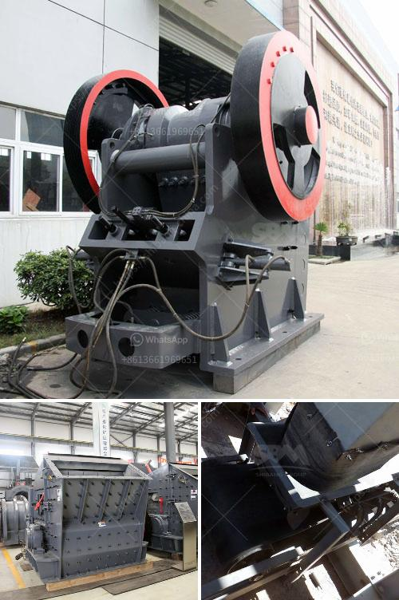

<h3>vibrating screen working principle</h3>
A vibrating screen is a commonly used screening equipment in industry. Its role is to separate the particles of different sizes into different levels of granularity through the vibration of the screen mesh. This process forms a circular motion on the screen surface, which can effectively screen materials and classify them.

The vibration motion of the screen is achieved by the vibrating motor, which drives the screen plate to vibrate at a certain frequency. The vibration force generated by the motor drives the screen box to perform a continuous circular motion, thereby achieving the purpose of screening.

The material is evenly distributed on the screen surface by the feeding mechanism. When the vibrating screen starts, the screen box and the screen plate will move in a circular motion, causing the material to be thrown around the screen surface. Under the action of continuous vibration, the material moves forward in a spiral manner on the screen surface, and the smaller particles gradually pass through the screen mesh and fall into the lower layer of the screen box.

The size of the screen mesh and the inclination angle of the screen surface can be adjusted according to the specific requirements of the material. By changing these parameters, different levels of granularity can be achieved. In addition, the vibrating screen can also be equipped with a dehydrating mechanism to further enhance the dewatering effect of the material.

In conclusion, the working principle of a vibrating screen is to use the vibration motor to drive the screen plate to perform a continuous circular motion, and the material is distributed on the screen surface by the feeding mechanism. Under the action of vibration, smaller particles pass through the screen mesh and fall into the lower layer of the screen box, while larger particles are discharged from the outlet. This process effectively classifies and screens materials, making it a widely used equipment in various industries.
<h3>Contact us</h3><ul><li><strong>Whatsapp:&nbsp;<a href="https://wa.me/8613661969651">+8613661969651</a></strong></li><li><a href="https://swt.shibang-china.com/?git&amp;zhl&amp;vibrating screen working principle"><strong>Online Service(chat now)</strong></a></li></ul><h3>Related</h3><ul><li><a href='raymond mills for sale in pakistan.md'>raymond mills for sale in pakistan</a></li><li><a href='screw conveyor blade calculation.md'>screw conveyor blade calculation</a></li><li><a href='hammer mill 150 250.md'>hammer mill 150 250</a></li><li><a href='quarry crusher equipment for sale in south africa.md'>quarry crusher equipment for sale in south africa</a></li><li><a href='frac sand processing plants for sale.md'>frac sand processing plants for sale</a></li></ul>