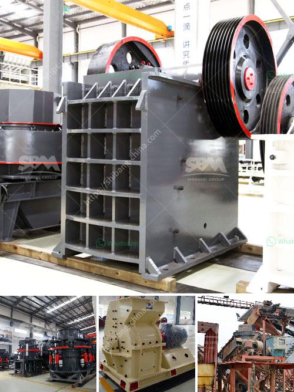

<h3>vibrating sieve supplier in south africa</h3>
In the industrial sector, having the right equipment for the job is crucial for optimal performance and production. One essential tool used in various industries is a vibrating sieve. This device is integral in separating and sorting materials, ensuring uniformity and removing any unwanted particles. In South Africa, industries rely on reputable vibrating sieve suppliers to cater to their needs, and one such notable supplier is recognized for both efficiency and quality.

With a wide range of vibrating sieves available in South Africa, customers are spoilt for choice when it comes to selecting the right supplier. However, one name that stands out amongst the rest is known for their commitment to customer satisfaction and provision of high-quality equipment.

This vibrating sieve supplier in South Africa not only offers top-of-the-line vibrating sieves but also provides exceptional customer service. Their team of experts assists customers in choosing the appropriate sieve for their specific requirements, offering guidance and answering any queries along the way.

One significant advantage of partnering with this supplier is the efficiency offered by their vibrating sieves. These machines are designed to maximize productivity by delivering accurate and consistent sifting results. The higher efficiency leads to time and cost savings, benefiting businesses across various industries.

Quality is another crucial aspect when it comes to choosing a vibrating sieve supplier. The supplier in question prides themselves on supplying durable and reliable sieves that withstand demanding industrial environments. This ensures that businesses can depend on their sieves for long-term use, minimizing downtime and maintenance costs.

Furthermore, the supplier offers a wide range of sieve sizes to accommodate different materials and particle sizes. This flexibility aids various industries such as mining, construction, and food processing, where different products require specific sieving requirements.

In conclusion, when it comes to selecting a vibrating sieve supplier in South Africa, it is essential to choose a reliable and efficient provider. This particular supplier stands out for their commitment to customer satisfaction, remarkable efficiency, and high-quality equipment. By partnering with them, businesses can enhance productivity, achieve accurate sifting results, and enjoy long-term durability.
<h3>Contact us</h3><ul><li><strong>Whatsapp:&nbsp;<a href="https://wa.me/8613661969651">+8613661969651</a></strong></li><li><a href="https://swt.shibang-china.com/?git&amp;zhl&amp;vibrating sieve supplier in south africa"><strong>Online Service(chat now)</strong></a></li></ul><h3>Related</h3><ul><li><a href='stone crushing in mineral processing.md'>stone crushing in mineral processing</a></li><li><a href='nirani cement plant.md'>nirani cement plant</a></li><li><a href='used aggregate crushing plant for sale.md'>used aggregate crushing plant for sale</a></li><li><a href='sand and gravel suppliers located in cebu.md'>sand and gravel suppliers located in cebu</a></li><li><a href='gold ore processing plant in germany.md'>gold ore processing plant in germany</a></li></ul>