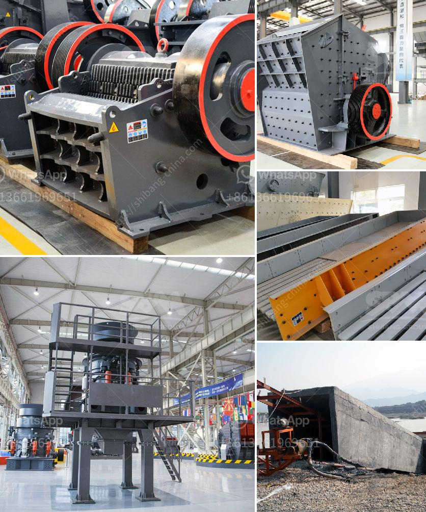

<h3>vibrating vibrating grizzly feeder capacity</h3>
A vibrating grizzly feeder is an essential equipment in the crushing and screening industry. It is used to separate feed material into small pieces for subsequent processing. The capacity of a vibrating grizzly feeder mainly depends on the size, characteristics, and density of the material being fed. The feeder's design also plays a vital role in determining its capacity.

When selecting a vibrating grizzly feeder, it is essential to consider the feed material's size and characteristics. The feeder's capacity will vary depending on the maximum size of the materials. Smaller materials can be effectively fed at higher capacity, while larger rocks may require a slower feed rate to prevent jamming or excessive wear on the feeder components.

The density of the material being fed also impacts the feeder's capacity. Dense materials like ores and stones tend to require more power and have a lower feed rate compared to lighter materials. It is crucial to match the feeder's capacity to the density and volume of the material to ensure efficient processing.

Apart from the material characteristics, the design of the vibrating grizzly feeder significantly affects its capacity. The feeder's design includes factors like the hopper size, slope, and angle. A properly designed feeder will have sufficient capacity to handle the given load and provide a consistent and controlled feed rate.

A vibrating grizzly feeder with a capacity of 100-300 tons per hour is ideal for removing undersized rock and ore from feed material before primary crushing equipment. The amplitude and motion come from large, twin shaft eccentric heads utilizing extra-large bearing assemblies for long life and ease of maintenance.

The grizzly sections of the feeder are bolted, allowing for easy replacement when needed. The feeder can be customized with optional high sides and extended feed boxes for improved capacity. Its robust design and high-quality construction materials make it suitable for heavy-duty applications and continuous operation.

In conclusion, the capacity of a vibrating grizzly feeder is determined by the size, characteristics, and density of the material being fed. Proper selection and design of the feeder are crucial to achieving optimal capacity and efficient operations. With a capacity of 100-300 tons per hour, a vibrating grizzly feeder is a reliable and essential equipment for various industries, including mining, recycling, and construction.
<h3>Contact us</h3><ul><li><strong>Whatsapp:&nbsp;<a href="https://wa.me/8613661969651">+8613661969651</a></strong></li><li><a href="https://swt.shibang-china.com/?git&amp;zhl&amp;vibrating vibrating grizzly feeder capacity"><strong>Online Service(chat now)</strong></a></li></ul><h3>Related</h3><ul><li><a href='jual stone crusher portable.md'>jual stone crusher portable</a></li><li><a href='africa sand washing plant for rent and sale.md'>africa sand washing plant for rent and sale</a></li><li><a href='price of stone crusher from china.md'>price of stone crusher from china</a></li><li><a href='plant machinery manufacturers in germany.md'>plant machinery manufacturers in germany</a></li><li><a href='rotary dryer sales indonesia.md'>rotary dryer sales indonesia</a></li></ul>