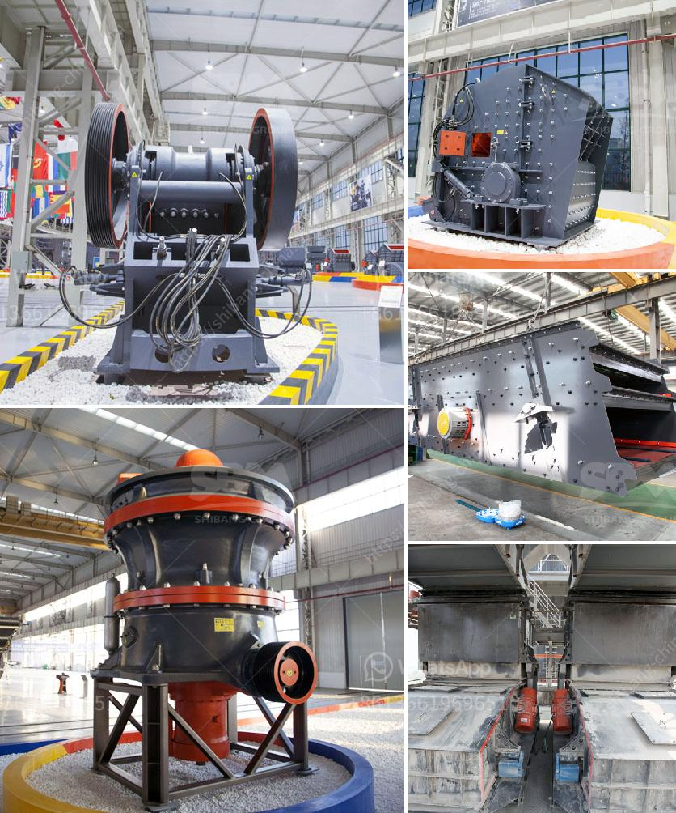

<h3>vsi crusher for crush sand</h3>
The VSI crusher, also known as the vertical shaft impact crusher, is a versatile and efficient crusher utilized in the crushing and shaping of various minerals and aggregates. Although it has been around for many years, this machine is progressively gaining traction as a viable option to traditional crushers for natural or artificial sand production.

One of the primary advantages of the VSI crusher is its ability to produce high-quality cubical end products. With a unique rock-on-rock crushing principle, the VSI crusher uses velocity rather than force as its crushing mechanism. The feed material is accelerated into the rotor, impacting the surrounding anvils and breaking it into smaller pieces. This action ensures that the resulting crushed sand particles have a consistent shape and texture, ideal for use in construction and civil engineering projects.

Furthermore, the VSI crusher is incredibly efficient when it comes to crushing hard and abrasive materials. It can handle various types of rocks, such as basalt, granite, gneiss, and limestone, providing superior reduction ratios compared to other crushers. Additionally, the rotor design and high-speed rotation assure proper crushing of materials, reducing wear on the anvils and prolonging the machine's lifespan.

The VSI crusher is also known for its low operating costs. This is due to the crushing chamber design and the high rotational speed of the rotor. Besides, low wear rates are a result of the unique rock-on-rock crushing action, minimizing the need for frequent replacements of wear parts, such as anvils, as compared to other crushers used for sand production.

In terms of environmental impact, the VSI crusher stands out as an eco-friendly option. It significantly reduces dust emissions, noise levels, and vibration compared to traditional crushers. By utilizing the rock-on-rock crushing principle, the VSI crusher minimizes the generation of fines and improves overall particle shape, reducing the need for excessive screening and washing of sand.

Another noteworthy advantage of the VSI crusher is its adaptability for various applications. Besides producing high-quality manufactured sand, it can also be used for shaping coarse aggregates, and even recycling of construction and demolition waste. The VSI crusher can crush and shape materials of different hardness levels, making it suitable for a wide range of industries, including mining, aggregate production, and construction.

Overall, the VSI crusher is a cost-effective and efficient crusher to produce high-quality sand. Its unique rock-on-rock crushing action, coupled with low operating costs, make it a preferable choice for many sand producers. Moreover, its adaptability for different applications and environmentally friendly features further contribute to its popularity. As the demand for quality sand continues to rise, the VSI crusher undoubtedly provides a reliable and efficient solution for sand production needs.
<h3>Contact us</h3><ul><li><strong>Whatsapp:&nbsp;<a href="https://wa.me/8613661969651">+8613661969651</a></strong></li><li><a href="https://swt.shibang-china.com/?git&amp;zhl&amp;vsi crusher for crush sand"><strong>Online Service(chat now)</strong></a></li></ul><h3>Related</h3><ul><li><a href='grinding of limestone crusher.md'>grinding of limestone crusher</a></li><li><a href='tertiary stone crusher.md'>tertiary stone crusher</a></li><li><a href='vibrating screen for crusher plant.md'>vibrating screen for crusher plant</a></li><li><a href='sand core machine manufacturers.md'>sand core machine manufacturers</a></li><li><a href='cost of the process of mining limestone.md'>cost of the process of mining limestone</a></li></ul>