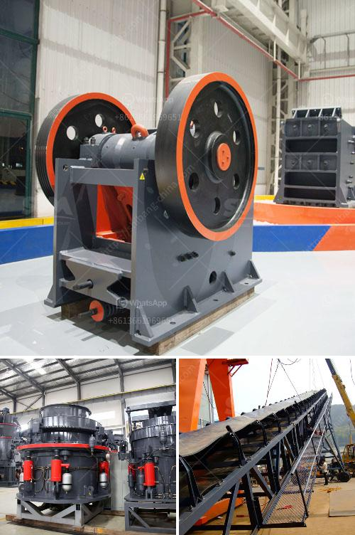

<h3>vsi crusher for quartz</h3>
The world of construction and mining relies heavily on quartz as an essential raw material. Nowadays, various industries are using quartz as a vital component in their manufacturing processes, as it possesses exceptional hardness and resilience. The rise in demand for quartz has led to the development of advanced machinery like the VSI crusher.

The VSI crusher, also known as the vertical shaft impactor, is a type of crusher that uses a high-speed rotating impeller to crush quartz into very fine particles. These particles are then dispersed throughout the material bed, resulting in a solid, consistent texture. This unique crushing action ensures superior performance and produces a high-quality product.

One of the remarkable features of the VSI crusher is its ability to produce cubical-shaped end products. When quartz is crushed using other conventional crushing methods, it often generates grains with rough and uneven edges. This uneven texture can adversely affect the overall quality of the final product. However, the VSI crusher's specialized crushing mechanism ensures that the quartz particles are uniformly shaped, making them highly suitable for various applications.

Additionally, the VSI crusher offers significant advantages in terms of cost-efficiency and energy conservation. The high-speed rotor assembly efficiently utilizes the kinetic energy generated from the quartz crushing process, resulting in reduced power consumption. This not only helps manufacturers save on electricity costs but also contributes to environmental sustainability.

Moreover, the VSI crusher is a versatile machine that can be adjusted to suit different crushing requirements. By simply changing the rotor speed or adjusting the cascade ratio, manufacturers can customize the particle size distribution to meet specific needs. This adaptability enables them to produce quartz materials in various sizes and grades, expanding their market reach and catering to diverse customer demands.

Furthermore, the VSI crusher's robust construction ensures durability and longevity. Its wear-resistant parts, such as the rotor and anvils, are made from high-quality materials and are designed to withstand the harsh conditions of quartz crushing. This results in a longer lifespan and reduced maintenance costs, providing manufacturers with a reliable and cost-effective solution.

In conclusion, the VSI crusher has revolutionized the quartz crushing industry by offering superior performance, cost-efficiency, and flexibility. Its ability to produce finely shaped particles and tailor the product to specific requirements has made it an indispensable tool for manufacturers. With the increasing demand for high-quality quartz materials, the VSI crusher has proven to be an essential machine in the construction and mining sectors. As technology continues to advance, we can expect further advancements in the design and capabilities of the VSI crusher, leading to enhanced productivity and profitability for the industry.
<h3>Contact us</h3><ul><li><strong>Whatsapp:&nbsp;<a href="https://wa.me/8613661969651">+8613661969651</a></strong></li><li><a href="https://swt.shibang-china.com/?git&amp;zhl&amp;vsi crusher for quartz"><strong>Online Service(chat now)</strong></a></li></ul><h3>Related</h3><ul><li><a href='cost of gold beneficiation plant.md'>cost of gold beneficiation plant</a></li><li><a href='talcum powder supplier for production.md'>talcum powder supplier for production</a></li><li><a href='equipment roller mill.md'>equipment roller mill</a></li><li><a href='chinese jaw crusher.md'>chinese jaw crusher</a></li><li><a href='manganese ore mining processing process equipment.md'>manganese ore mining processing process equipment</a></li></ul>