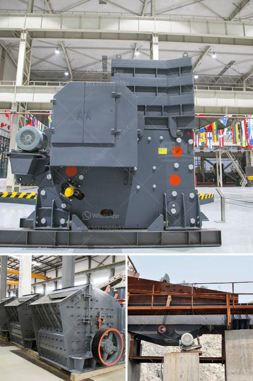

<h3>vsi impact crusher</h3>
The VSI (Vertical Shaft Impactor) crusher is a popular choice for producing artificial sand and aggregates for various construction applications such as concrete production and road construction industries. It is widely used in processing materials such as rock, abrasive, refractory, cement clinker, quartzite, iron ore, and concrete aggregate.

The VSI crusher utilizes velocity rather than pressure as the predominant force to break rocks. In this method, materials are fed into the rotor, which rapidly accelerates and then discharges the rock at high speed against a stationary surface. As a result, the rock is shattered into smaller pieces, which can further be processed into the desired shape and size.

There are several key advantages of using a VSI crusher for crushing rocks and aggregates. Firstly, it offers excellent particle shape and consistent gradation, which is essential for producing high-quality concrete mixes. The VSI crusher has the ability to control the product gradation by adjusting the speed of the rotor and the gap between the rotor and the breaker plates. This feature allows the operator to produce different fractions of aggregates according to the specific requirements of the application.

Another advantage of the VSI crusher is its low operating cost compared to other crushing equipment. The high-speed rotor of the VSI crusher consumes less power and can process a greater amount of material per hour, resulting in lower operational costs. Additionally, the VSI crusher requires minimal maintenance due to its robust construction and fewer moving parts. This reduces downtime and increases the overall efficiency of the crushing process.

Furthermore, the VSI crusher is environmentally friendly as it produces less noise and dust during operation. The enclosed rotor design of the VSI crusher ensures that the rock particles do not escape into the surrounding environment, minimizing pollution. This is particularly important in urban areas where strict regulations are in place to control noise and dust emissions from construction sites.

The versatility of the VSI crusher is also worth noting. It can be used in a wide range of applications, from producing artificial sand for the construction industry to shaping stones for landscaping purposes. The VSI crusher can handle various materials with different hardness levels and moisture content, making it a flexible tool for a variety of crushing tasks.

In conclusion, the VSI impact crusher is a versatile and cost-effective crushing solution that provides excellent particle shape and consistent gradation. Its low operating costs, minimal maintenance requirements, and environmental friendliness make it a preferred choice for customers in the construction industry. Whether it is for producing artificial sand or shaping stones, the VSI crusher offers superior performance and efficiency.
<h3>Contact us</h3><ul><li><strong>Whatsapp:&nbsp;<a href="https://wa.me/8613661969651">+8613661969651</a></strong></li><li><a href="https://swt.shibang-china.com/?git&amp;zhl&amp;vsi impact crusher"><strong>Online Service(chat now)</strong></a></li></ul><h3>Related</h3><ul><li><a href='crusher price malaysia.md'>crusher price malaysia</a></li><li><a href='barytes pulverizer equipment.md'>barytes pulverizer equipment</a></li><li><a href='automation conveyor belts.md'>automation conveyor belts</a></li><li><a href='sandstone sand making machine manufacturer.md'>sandstone sand making machine manufacturer</a></li><li><a href='crusher machine for sale kenya.md'>crusher machine for sale kenya</a></li></ul>