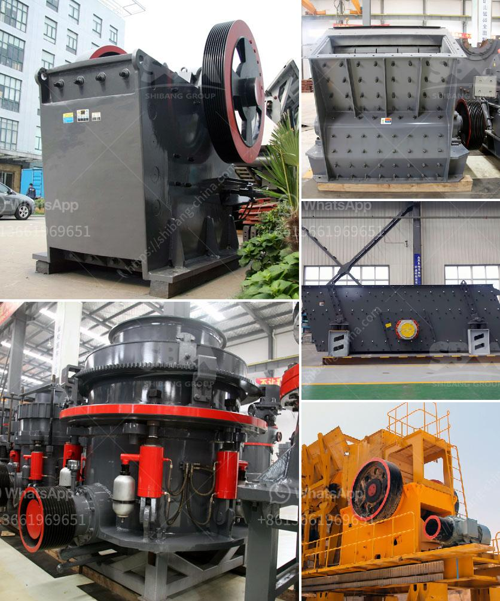

<h3>washing plant mining prices</h3>
Mining is a key industry responsible for the extraction of valuable minerals from the earth's crust. Within this sector, washing plants play a crucial role in processing ore and separating valuable materials from waste. However, the prices associated with washing plant mining can vary significantly based on several factors, including equipment quality, technological advancements, market demand, and environmental regulations.

One of the primary factors influencing washing plant mining prices is the quality of the equipment itself. Advanced and efficient washing plants tend to come at a higher cost due to their sophisticated technologies, enhanced productivity, and durability. Such plants often boast features like automated control systems, effective water recycling mechanisms, and precise mineral separation capabilities. Investing in these top-of-the-line facilities could result in increased operational efficiency and lower costs in the long run.

Technological advancements also have a significant impact on washing plant mining prices. Over the years, innovation has led to the development of more efficient and environmentally friendly mining equipment. Cutting-edge technologies can significantly reduce water and energy consumption, which not only saves costs but also mitigates the ecological impact of the mining process. As new technologies continue to emerge, washing plant mining prices may fluctuate as older, less efficient models become replaced by newer, more sustainable alternatives.

Market demand plays a crucial role in shaping washing plant mining prices. Industries reliant on mineral extraction, such as construction, manufacturing, and electronics, heavily influence the demand for mined minerals. When these sectors experience growth or increasing demand for specific minerals, the prices of washing plant mining can rise. Conversely, during periods of economic downturn or reduced demand, prices may decline as competition among mining companies increases. Market fluctuations necessitate continuous adaptation and optimization of mining operations to stay competitive and minimize costs.

Environmental regulations also impact washing plant mining prices. Governments enforce stringent regulations to protect natural resources, decrease pollution, and ensure responsible mining practices. Compliance with such regulations often requires additional investments in technologies that control air emissions, limit water usage, and manage waste discharge. While these measures may raise the initial costs of washing plant mining, they are essential for securing mining permits, maintaining public trust, and upholding sustainable business practices.

In conclusion, the prices associated with washing plant mining are influenced by various factors. The quality of equipment, technological advancements, market demand, and environmental regulations all play a role in determining the costs incurred in this sector. Companies must carefully assess these factors to make informed decisions about their mining operations, striking a balance between cost-efficiency and sustainable practices. As the industry continues to evolve, monitoring market trends, embracing emerging technologies, and adhering to regulatory requirements will be crucial for mining companies to navigate the complex landscape of washing plant mining prices.
<h3>Contact us</h3><ul><li><strong>Whatsapp:&nbsp;<a href="https://wa.me/8613661969651">+8613661969651</a></strong></li><li><a href="https://swt.shibang-china.com/?git&amp;zhl&amp;washing plant mining prices"><strong>Online Service(chat now)</strong></a></li></ul><h3>Related</h3><ul><li><a href='second hand jaw crusher for sale in harare.md'>second hand jaw crusher for sale in harare</a></li><li><a href='slag crusher plant manufacturer india.md'>slag crusher plant manufacturer india</a></li><li><a href='crusher plant design.md'>crusher plant design</a></li><li><a href='mobile screen and crushing.md'>mobile screen and crushing</a></li><li><a href='griding machine zenith.md'>griding machine zenith</a></li></ul>