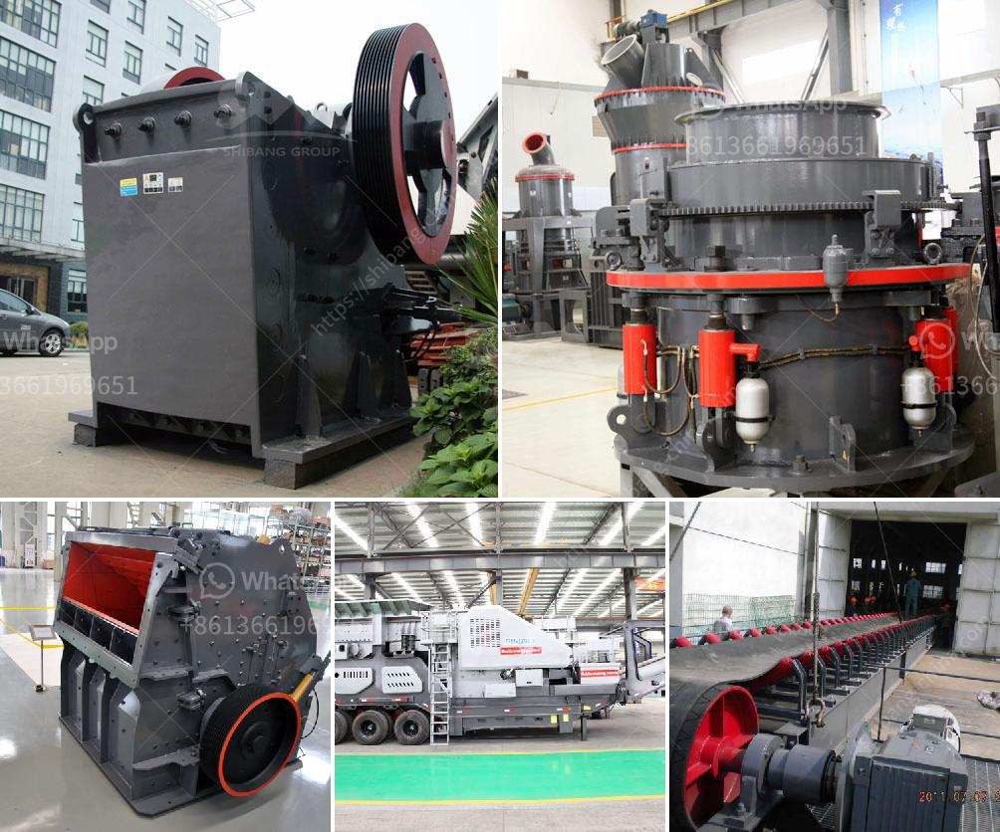

<h3>wet and dry ball mill</h3>
The Ball Mill is used to grind materials into extremely fine powder for use in mineral dressing processes, paints, pyrotechnics, ceramics and selective laser sintering. The wet ball mill is often equipped with a classifier whereas the dry one with a suction and separating device.

Compared with the Raymond mill, the ball mill can grind metal ore. gallery - Applicable materials: iron ore, slag, copper ore, silver ore, galena, etc.

The ball mill is mainly composed of a feeder, a discharging port, a turning device, transmitting devices that include a reduction gear, a motor, and the working principle of the ball mill. The ball mill uses a cylindrical container that rotates on a horizontal axis. This container is generally filled with the material to be ground, and grinding medium, which refers to the grinding balls. Different materials are used as media, including ceramic balls, flint pebbles, and stainless steel balls.

The wet ball mill process has been used for over 140 years to grind ores and minerals, cement raw materials, and clinker. In recent years, it has been increasingly used for grinding mechanical alloying and solid-state chemical reactions. The dry ball mill process is usually carried out using air separators, while hydraulic classifiers are used for wet ball mill applications.

The use of a wet or dry grinding process depends on the product properties and the desired application. Wet ball mill grinding has the advantages of: i) Uniform product size and material surface roughness. ii) Easy handling and low maintenance. iii) Reduced weight, low wear, and abrasion. On the other hand, dry ball mill grinding has the following disadvantages: i) Difficult to add water for material hydration. ii) Longer drying time. iii) Reduced mill power consumption.

The wet ball mill is widely used in metal and non-metal ore beneficiation plants, refractory material factories, chemical industry, and glass ceramics. Dry ball mills are used for material handling, such as metallurgy, mine, chemical industry, cement, and other industries. It provides various types of grinding media for different applications, such as steel balls for grinding cement, ceramic balls for grinding silica sand, etc.

The wet and dry ball mill processes have different advantages and disadvantages. Wet grinding is generally preferred because of lower power consumption and higher mill capacity. However, the drying process can become costly and energy-intensive due to the need for additional drying equipment. On the other hand, dry grinding is advantageous as it allows for easy control of the grinding media and avoids the potential contamination of the final product.

In conclusion, both wet and dry ball mills have their uses and advantages depending on the specific requirement. The wet ball mill is more suitable for grinding minerals, while the dry ball mill is ideal for grinding materials like cement. Overall, the decision between wet or dry grinding is influenced by several factors, including the final product size, the required grinding media, and the ore properties.
<h3>Contact us</h3><ul><li><strong>Whatsapp:&nbsp;<a href="https://wa.me/8613661969651">+8613661969651</a></strong></li><li><a href="https://swt.shibang-china.com/?git&amp;zhl&amp;wet and dry ball mill"><strong>Online Service(chat now)</strong></a></li></ul><h3>Related</h3><ul><li><a href='ball mills prices.md'>ball mills prices</a></li><li><a href='design of harmer mill.md'>design of harmer mill</a></li><li><a href='marble grinder price in india.md'>marble grinder price in india</a></li><li><a href='standard conveyor belts.md'>standard conveyor belts</a></li><li><a href='calcium carbonate plant in bulacan.md'>calcium carbonate plant in bulacan</a></li></ul>