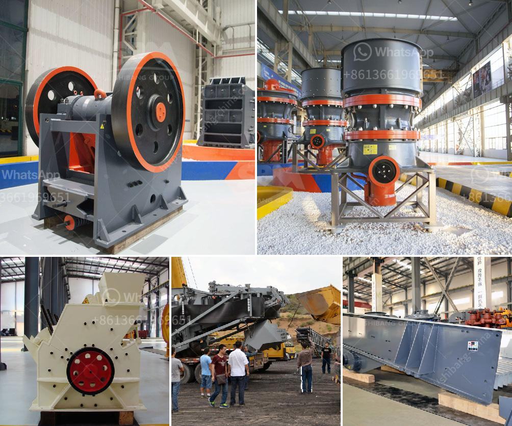

<h3>what is expected cost of 100 tph crushing plant</h3>
Crushing plants are utilized to break down large stones, rocks, and other materials into smaller pieces in order to facilitate the production of aggregate, which is crucial for various construction projects. When planning to set up a crushing plant, the cost plays a crucial role. In this article, we will discuss the expected cost of a 100 TPH crushing plant.

Before getting into the specific figures, it's important to understand that the cost of a crushing plant can vary depending on several factors. These factors include the type of machine, the required capacity, the location, the raw material being processed, and the market demand. Hence, the figures presented here are average estimations and should be regarded as such.

When looking at the expected cost of a 100 TPH crushing plant, it is important to consider the machines involved in the process. Typically, a crushing plant consists of primary crusher, secondary crusher, and vibrating screens. The primary crusher is responsible for breaking down the rocks into smaller pieces, whereas the secondary crusher further refines the material. The vibrating screens are used to sort and separate the crushed material based on size.

The cost of a primary crusher can range from $600,000 to $2 million, while the cost of a secondary crusher can range from $250,000 to $1 million. Additional equipment such as vibrating screens may add another $100,000 to $200,000 to the overall cost.

Apart from the machinery, other factors that impact the cost of a crushing plant include location and transportation. The distance between the quarry or mining site and the construction project can significantly influence the cost. If the site is far away, the transportation expenses will rise, increasing the overall cost of the project.

It's important to note that the cost of a 100 TPH crushing plant can also be influenced by the raw material being processed. Different materials require different types of machinery and may have varying hardness levels. Harder materials may require more robust machines, which can increase the overall cost of the plant.

Lastly, market demand can also impact the cost of a crushing plant. If there is a high demand for aggregate in a specific region, the overall cost of the plant may be higher due to increased competition and higher machine prices.

In conclusion, the expected cost of a 100 TPH crushing plant can range from $600,000 to $3 million, depending on the factors mentioned above. It is crucial to conduct thorough research and consult experts to accurately estimate the cost and ensure a successful and cost-effective project.

Disclaimer: The figures and estimations provided in this article are for informational purposes only and should not be considered as exact values. The cost can vary significantly based on various factors, and professional consultation is advised for accurate estimations.
<h3>Contact us</h3><ul><li><strong>Whatsapp:&nbsp;<a href="https://wa.me/8613661969651">+8613661969651</a></strong></li><li><a href="https://swt.shibang-china.com/?git&amp;zhl&amp;what is expected cost of 100 tph crushing plant"><strong>Online Service(chat now)</strong></a></li></ul><h3>Related</h3><ul><li><a href='talcum powder supplier for production.md'>talcum powder supplier for production</a></li><li><a href='how to extract gold from river sand.md'>how to extract gold from river sand</a></li><li><a href='iron processing plant in mexico.md'>iron processing plant in mexico</a></li><li><a href='marble grinder mill machine.md'>marble grinder mill machine</a></li><li><a href='quartz crusher plant manufacturers in india.md'>quartz crusher plant manufacturers in india</a></li></ul>