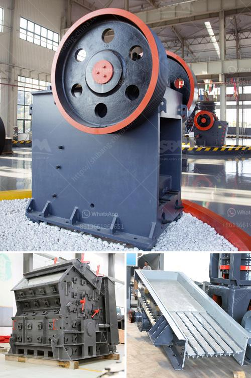

<h3>write an article about cube crushing machine for concrete with 100-300 words</h3>
A concrete cube is a standardized test specimen that is used in the industry to ascertain the strength of concrete mixtures. These test cubes are typically made from concrete batches and are subjected to varying compressive strengths to determine their capacity for load-bearing. The machines designed for this purpose are known as cube crushing machines.

Concrete cube crushing machines are highly essential in the construction industry as they provide a means to carry out the compression strength test. This test is used to determine the compressive strength of a concrete cube, which has been cast and hardened. The machine provides resistance against the destructive force which acts on the cube by loading it in a way that the compressive strength is tested accurately.

Cube crushing machines are vital equipment in situations where it is essential to assess the potential load-bearing capabilities of concrete structures. In most cases, the quality of concrete is largely dependent on the quality of the cubes manufactured by the machine. Inadequate or substandard cubes can lead to inaccurate results and impact the overall quality of a construction project.

The cube crushing machine is loaded with some kind of fluid or hydraulic liquid to reach a desired level of compression resistance. Hydraulic machines typically use hydraulic fluids, while electro-mechanical machines may use oil, air, or any other fluid depending on the application and design.

In conclusion, the cube crushing machines conveniently reduce the effort required to test the compressive strength of concrete. These machines are vital in the construction industry as concrete is used extensively in the majority of building projects. The efficiency and accuracy of cube crushing machines ensure that reliable results are obtained, allowing professional judgments to be made about the quality and suitability of concrete mixtures for different construction needs.
<h3>Contact us</h3><ul><li><strong>Whatsapp:&nbsp;<a href="https://wa.me/8613661969651">+8613661969651</a></strong></li><li><a href="https://swt.shibang-china.com/?git&amp;zhl&amp;write an article about cube crushing machine for concrete with 100300 words"><strong>Online Service(chat now)</strong></a></li></ul><h3>Related</h3><ul><li><a href='grinding mills in pakistan.md'>grinding mills in pakistan</a></li><li><a href='hammer crusher in power plant.md'>hammer crusher in power plant</a></li><li><a href='grinder machine for quartz.md'>grinder machine for quartz</a></li><li><a href='crusher philippines.md'>crusher philippines</a></li><li><a href='rock crusher plans.md'>rock crusher plans</a></li></ul>