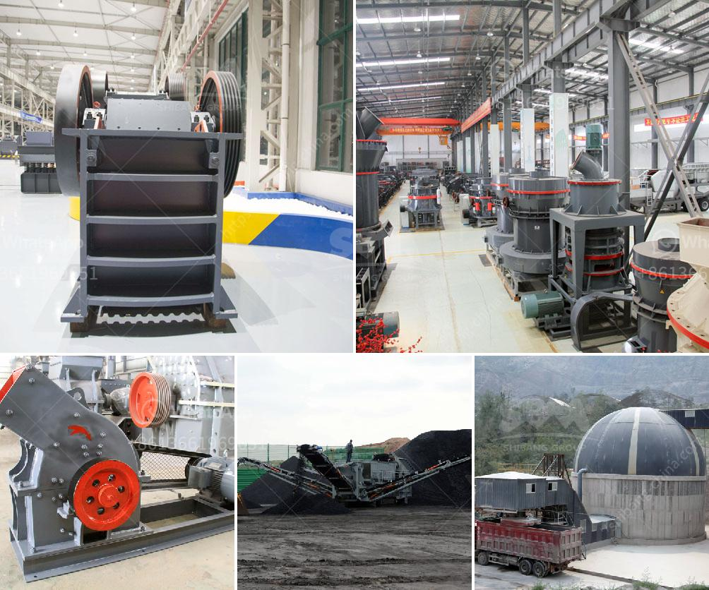

<h3>write an article about jaw crusher philippines prices with 100-300 words</h3>
The Philippines is a country rich in mineral resources. The mining industry plays a significant role in the country's economic growth. With its abundance of valuable minerals, the Philippines is a thriving market for jaw crushers. Jaw crushers are widely used in the mining and construction industry due to their ability to crush hard and abrasive materials.

When it comes to purchasing jaw crushers in the Philippines, there are several factors to consider. One important factor is the price. As one of the leading manufacturers and suppliers of jaw crushers in the Philippines, we understand that the price of equipment can be a significant investment. However, it is crucial to ensure that you are getting the best value for your money.

The prices of jaw crushers in the Philippines can vary depending on the brand, quality, and specifications. Our machines are competitively priced and we offer service and maintenance to ensure optimal performance. Our jaw crushers are built to withstand the demanding requirements of the mining industry, providing reliable and efficient crushing capabilities.

In addition to competitive prices, our jaw crushers come with a range of features and options to enhance productivity and efficiency. These include adjustable settings for different material sizes, a remote control system for ease of operation, and low noise levels for a comfortable working environment. We also offer after-sales support and spare parts to ensure the longevity of your equipment.

Investing in a jaw crusher in the Philippines is a wise decision, especially with the country's booming mining industry. Considering the competitive prices, reliable performance, and excellent after-sales support, our jaw crushers are worth considering. Whether you are in the mining, construction, or recycling industry, our jaw crushers can help you efficiently crush materials and maximize your productivity.

In conclusion, investing in a jaw crusher in the Philippines is a cost-effective and reliable solution for any mining or construction project. Whether you are a start-up mining company or an established operation, we can provide the right jaw crusher for your needs. We offer a range of models and sizes to suit your specific requirements, so contact us today to discuss your jaw crusher needs.
<h3>Contact us</h3><ul><li><strong>Whatsapp:&nbsp;<a href="https://wa.me/8613661969651">+8613661969651</a></strong></li><li><a href="https://swt.shibang-china.com/?git&amp;zhl&amp;write an article about jaw crusher philippines prices with 100300 words"><strong>Online Service(chat now)</strong></a></li></ul><h3>Related</h3><ul><li><a href='small hammer mill grinder 10 mm.md'>small hammer mill grinder 10 mm</a></li><li><a href='design and fabrication of ball mill pdf.md'>design and fabrication of ball mill pdf</a></li><li><a href='steel casting mining machinery parts wedge plate.md'>steel casting mining machinery parts wedge plate</a></li><li><a href='coal screening chrushing machines.md'>coal screening chrushing machines</a></li><li><a href='tertiary vertical shaft impact crusher.md'>tertiary vertical shaft impact crusher</a></li></ul>