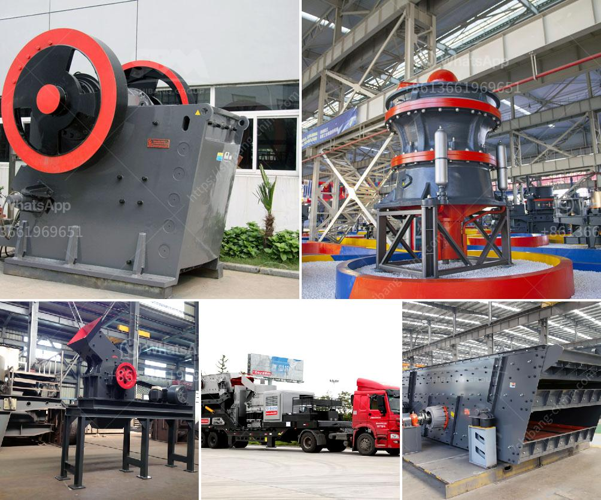

<h3>zircon sand mining companies list in canada</h3>
Zircon sand is a naturally occurring mineral found in beach sands along the coastlines of several countries. It is known for its high refractory properties and excellent heat resistance, making it a crucial ingredient in the production of ceramic materials, refractory bricks, and foundry molds. Canada is one of the leading producers of zircon sand, with several mining companies operating in the country.

1. Astron Limited: This Australian-based company has operations in several countries, including Canada. Astron Limited's zircon mining operations in Canada are located in Quebec, where the company owns and operates the Saint-Urbain Mine. The mine is known for its high-grade zircon sand, which is processed and exported to various industrial customers worldwide.

2. Arrowsmith North Limited: Based in Canada, Arrowsmith North Limited is primarily focused on mineral exploration and development. The company holds several mining claims in the Province of Quebec, including some with known zircon deposits. Arrowsmith North Limited is currently undertaking feasibility studies to determine the commercial viability of extracting zircon sand from these deposits.

3. Titanium Corporation: Although primarily focused on titanium mining and production, Titanium Corporation also extracts zircon sand as a byproduct of its operations. The company's flagship project, located in the Athabasca oil sands region of Alberta, involves the extraction and recovery of valuable minerals from oil sands tailings. Zircon sand is one of the minerals recovered in this process and contributes to the company's overall revenue.

4. Santoy Resources Ltd: With headquarters in British Columbia, Santoy Resources Ltd is engaged in the exploration and development of mineral properties in Canada. The company holds mining claims in Quebec and Ontario, which are known to contain zircon sand deposits. Santoy Resources Ltd is currently in the early stages of exploration and is assessing the economic viability of these deposits.

5. Mineral Commodities Ltd: Although an Australia-based company, Mineral Commodities Ltd has operations in Canada through its subsidiary, MRC Exploration Canada Ltd. The company holds exploration permits in New Brunswick and Quebec, with significant zircon sand potential. Mineral Commodities Ltd is actively exploring these properties and evaluating the feasibility of establishing mining operations in the country.

Overall, zircon sand mining in Canada plays a vital role in supplying the global market with this valuable mineral. The presence of several mining companies highlights the country's rich deposits and potential for further exploration and development. These companies contribute to Canada's economy by creating jobs, generating revenue, and promoting technological advancements in the zircon industry.

However, it is crucial for these mining operations to adhere to stringent environmental regulations and sustainable practices to minimize their impact on the surrounding ecosystems. Responsible mining practices are essential to protect the environment and maintain the long-term viability of zircon sand resources in Canada.
<h3>Contact us</h3><ul><li><strong>Whatsapp:&nbsp;<a href="https://wa.me/8613661969651">+8613661969651</a></strong></li><li><a href="https://swt.shibang-china.com/?git&amp;zhl&amp;zircon sand mining companies list in canada"><strong>Online Service(chat now)</strong></a></li></ul><h3>Related</h3><ul><li><a href='grinding ball mill philippines.md'>grinding ball mill philippines</a></li><li><a href='coal machines for sale in south africa.md'>coal machines for sale in south africa</a></li><li><a href='price of stone crusher from china.md'>price of stone crusher from china</a></li><li><a href='mobile stone crusher 100 tph bangalore.md'>mobile stone crusher 100 tph bangalore</a></li><li><a href='dolomite crusher manufacturer in usa.md'>dolomite crusher manufacturer in usa</a></li></ul>